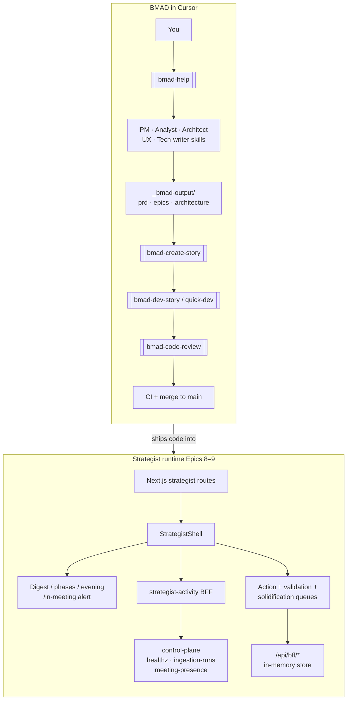

# DeployAI

[](./.nvmrc)
[](./pnpm-workspace.yaml)
[](./turbo.json)
[](./README.md#license)

**Agentic deployment system of record** — a canonical-memory-backed digital twin for long-cycle government deployments. Walk into every meeting prepared: claims are citation-backed, overrides are logged, retrieval is replayable.

---

## What it does

- **Morning loop (Epic 8)** — Digest, phase tracking, evening synthesis, Cmd+K chrome, inline evidence and `/evidence/[nodeId]`.
- **Reactive meeting + queues (Epic 9)** — In-meeting alert (presence stub + URL demos), three-item surface budget, carryover into an Action Queue, BFF-mocked queue lifecycles, validation and solidification surfaces.
- **Platform spine** — Control plane (FastAPI), ingestion, Cartographer / Oracle contracts, design tokens + `shared-ui`, multi-layer CI (smoke, a11y, schema, fuzz, SBOM, integration).

You plan in **BMAD** (`_bmad-output/`, `.cursor/skills/`). You ship in **`apps/web`**, **`services/*`**, **`packages/*`**. CI on every PR to `main` enforces the gates in [`.github/workflows/README.md`](./.github/workflows/README.md).

**Reality check for demos and stakeholder conversations:** [whats-actually-here.md](./whats-actually-here.md) — what is fixture vs live, demo checklist, and mermaid flows (living doc; update when surfaces change).

---

## What’s new

| Area | Change |
|------|--------|
| **FOIA CLI** | **`foia verify`** supports **v1 + v2** transcript manifests, **`--edge-revocation`** sidecar JSON (for edge kill enforcement once CP/agent ship), and **`foia export --out --account`** (Story 12.2 skeleton). See [docs/foia/bundle-format.md](./docs/foia/bundle-format.md). |
| **Ops** | [docs/human-ops-runbook.md](./docs/human-ops-runbook.md) — FOIA flags, integration tests, Sparkle pointer. |

---

## Why DeployAI (vs generic PM tools)

| Capability | DeployAI | Typical PM / chat |
|------------|----------|-------------------|
| **Mandatory citations** | Signed citation envelope + RFC-3161 posture (product intent) | Ad hoc links |
| **Tenant isolation** | Three-layer model + authz resolver | Varies |
| **Deterministic replay** | LangGraph checkpointing story (Cartographer) | None |
| **Compliance-native intent** | NIST AI RMF, 508/WCAG gates in CI from Epic 1 | Rare |
| **Strategist UX** | Digest ↔ same evidence in meeting alert | Siloed tools |

The [**MVP operating plan**](./_bmad-output/planning-artifacts/mvp-operating-plan-2026.md) sequences a demo-ready slice first; formal compliance program work is explicitly staged later.

---

## Quick start

```bash
git clone https://github.com/kennygeiler/DeployAI.git
cd DeployAI
# Node 24.x — see .nvmrc (root engines reject unsupported majors)
pnpm install --frozen-lockfile
pnpm turbo run lint typecheck test build
```

**Local services, env vars, and tool versions:** [docs/dev-environment.md](./docs/dev-environment.md)

**Strategist E2E (Playwright):** from `apps/web`, after a production build, `CI=1 pnpm test:e2e` (avoids attaching Playwright to the wrong process on `:3000`; see [apps/web/playwright.config.ts](./apps/web/playwright.config.ts)).

---

## Cursor / BMAD — what to say

| You want | Skill / entry |
|----------|----------------|
| Orient + next step | `bmad-help` |
| Sprint snapshot | `bmad-sprint-status` |
| PRD / epics / architecture | `bmad-create-prd`, `bmad-create-epics-and-stories`, `bmad-create-architecture` |
| UX + implementation readiness | `bmad-create-ux-design`, `bmad-check-implementation-readiness` |
| Author a story file | `bmad-create-story` |
| Implement from a story | `bmad-dev-story`, `bmad-quick-dev` |
| Adversarial review | `bmad-code-review` |
| Multi-agent discussion | `bmad-party-mode` |

Agents map to skills under [`.cursor/skills/`](./.cursor/skills/) (PM John, Analyst Mary, Architect Winston, UX Sally, Dev Amelia, Tech-writer Paige, etc.).

---

## Flows — BMAD + strategist runtime

**Programmatic source (copy into [Mermaid Live](https://mermaid.live) or Obsidian):** [`docs/diagrams/deployai-bmad-and-runtime-flow.mjs`](./docs/diagrams/deployai-bmad-and-runtime-flow.mjs) — exports `bmadAgentFlow`, `strategistRuntimeFlow`, and `bmadAndRuntimeFlow`.

Overview (same content as `bmadAndRuntimeFlow` in the `.mjs` file):



---

## Where things live

| Area | Notes |
|------|--------|
| `apps/web` | Next.js 16 strategist + admin; Epic 8–9 routes, BFF mocks, Playwright + Storybook |
| `apps/edge-agent` | Tauri desktop agent |
| `apps/foia-cli` | Go CLI |
| `services/control-plane` | FastAPI — tenancy, integrations, **meeting-presence** internal route (stub), pytest + Docker integration |
| `services/ingest` | Ingestion worker stack |
| `services/cartographer` | LangGraph stub, citation envelope path |
| `packages/` | `design-tokens`, `contracts`, **`shared-ui`**, `authz`, LLM adapters |
| `tests/` | Continuity, cross-tenant fuzz, shared harnesses |
| `infra/compose` | Local compose |
| `.github/workflows/` | CI, a11y, compose-smoke — [workflows README](./.github/workflows/README.md) |
| `_bmad-output/` | PRD, epics, sprint status, stories |
| `.cursor/skills/` | BMAD + Cursor skills |
| `docs/diagrams/` | Mermaid `.mjs` exports for flows |

**Full repo conventions:** [docs/repo-layout.md](./docs/repo-layout.md)

**Directory tree (short):**

```
DeployAI/
├── apps/           # web · edge-agent · foia-cli
├── services/       # control-plane · ingest · cartographer · _shared
├── packages/       # tokens, contracts, shared-ui, authz, …
├── tests/
├── docs/           # dev env, a11y, diagrams, …
├── _bmad-output/   # planning + sprint-status + stories
├── .cursor/skills/
└── .github/
```

---

## Planning & tracking

| Document | Purpose |
|----------|---------|
| [`_bmad-output/planning-artifacts/prd.md`](./_bmad-output/planning-artifacts/prd.md) | FRs / NFRs / design commitments |
| [`_bmad-output/planning-artifacts/architecture.md`](./_bmad-output/planning-artifacts/architecture.md) | Stack, deployment, ARs |
| [`_bmad-output/planning-artifacts/ux-design-specification.md`](./_bmad-output/planning-artifacts/ux-design-specification.md) | UX-DRs |
| [`_bmad-output/planning-artifacts/epics.md`](./_bmad-output/planning-artifacts/epics.md) | 14 epics, full story grid |
| [`_bmad-output/implementation-artifacts/sprint-status.yaml`](./_bmad-output/implementation-artifacts/sprint-status.yaml) | Machine-readable epic/story status |
| [`_bmad-output/implementation-artifacts/development-board.yaml`](./_bmad-output/implementation-artifacts/development-board.yaml) | Board, MVP tracks, risks |
| [`_bmad-output/planning-artifacts/mvp-operating-plan-2026.md`](./_bmad-output/planning-artifacts/mvp-operating-plan-2026.md) | MVP phasing |

**Status (high level):** Epics **1–8** are largely **done** on `main` for the walking skeleton. **Epic 9** is **in progress** — vertical slice merged (presence stub, queues BFF, surfaces, E2E). **Story 9.1** adds configurable **≤ 30 s** activity poll, documents CP meeting-presence + stub env, and a **single-sample ≤ 8 s** Playwright gate for the active alert card after a BFF `inMeeting` signal; **100-run p95**, Graph calendar wiring, and lazy-evidence timing remain vs `epics.md`. **Epic 7-15** (VPAT evidence pipeline) is backlog. Hardening notes: [`epic-8-implementation-status.md`](./_bmad-output/implementation-artifacts/epic-8-implementation-status.md).

---

## The defining user journey

> **07:00** — Morning Digest: “Permit #2231 blocked by DEP sign-off; last action 9 days ago.”  
> **10:03** — In-Meeting Alert during the DOT standup with the **same citation chip** — same evidence, same operator muscle memory.

---

## Strategist web (`apps/web`) — shipped highlights

- **Routes:** `/digest`, `/in-meeting`, `/phase-tracking`, `/evening`, `/evidence/[nodeId]`, `/action-queue`, `/validation-queue`, `/solidification-review`, placeholders (overrides, audit).
- **Remote fixtures (optional):** env URLs for digest / phase / evening JSON (see README history in git for variable names); failures are explicit when a URL is set.
- **FR41 / Story 8.4:** `CitationChip` + `EvidencePanel`, “Navigate to source” → `/evidence/:nodeId`. Playwright: [`strategist-command-palette.spec.ts`](./apps/web/tests/e2e/strategist-command-palette.spec.ts), [`mvp-golden-path.spec.ts`](./apps/web/tests/e2e/mvp-golden-path.spec.ts).
- **FR46 / FR47 / Story 8.7:** [`loadStrategistActivityForActor`](./apps/web/src/lib/internal/load-strategist-activity.ts) + [`StrategistShell.client.tsx`](./apps/web/src/app/(strategist)/StrategistShell.client.tsx) — demo query merges (`?agentError=1`, `?ingest=1`, `?inMeeting=1`, …).
- **`@deployai/shared-ui`:** build after source edits: `pnpm --filter @deployai/shared-ui build` (or full turbo build).

---

## Development & CI

- **Smoke loop:** `pnpm turbo run lint typecheck test build` from repo root.
- **Control plane:** [services/control-plane/README.md — Tests](./services/control-plane/README.md#tests); **Cartographer** tests run via turbo smoke.
- **`main` ruleset:** [`scripts/github/main-ruleset.json`](./scripts/github/main-ruleset.json) — [scripts/github/README.md](./scripts/github/README.md).
- **Retrospectives / deferrals:** [`_bmad-output/implementation-artifacts/`](./_bmad-output/implementation-artifacts/) — see `epic-*-retrospective*.md`, `deferred-work.md`.

---

## License

TBD.
