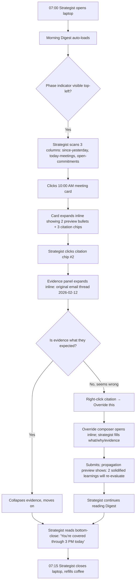
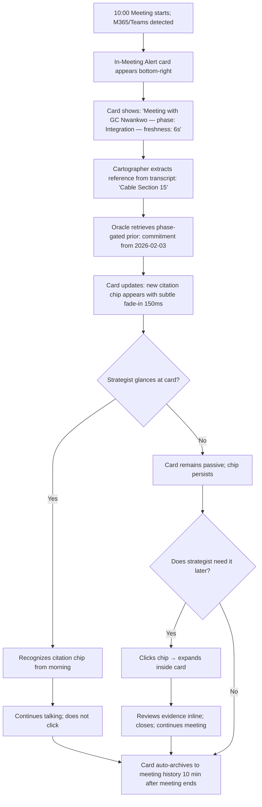
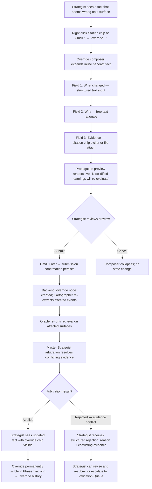
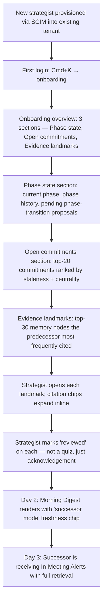

---
stepsCompleted:
  - step-01-init
  - step-02-discovery
  - step-03-core-experience
  - step-04-emotional-response
  - step-05-inspiration
  - step-06-design-system
  - step-07-defining-experience
  - step-08-visual-foundation
  - step-09-design-directions
  - step-10-user-journeys
  - step-11-component-strategy
  - step-12-ux-patterns
  - step-13-responsive-accessibility
  - step-14-complete
inputDocuments:
  - "_bmad-output/planning-artifacts/prd.md"
  - "_bmad-output/planning-artifacts/architecture.md"
  - "_bmad-output/planning-artifacts/product-brief-DeployAI.md"
  - "_bmad-output/planning-artifacts/product-brief-DeployAI-distillate.md"
  - "_bmad-output/brainstorming/brainstorming-session-2026-04-21-150108.md"
workflowType: 'ux-design'
project_name: 'DeployAI — Agentic Deployment System of Record'
user_name: 'Kenny Geiler'
date: '2026-04-21'
lastStep: 14
status: 'complete'
completedAt: '2026-04-21'
---

# UX Design Specification — DeployAI

**Author:** Kenny Geiler
**Date:** 2026-04-21

---

## Executive Summary

### Project Vision

DeployAI is the agentic Deployment System of Record for long-cycle regulated-customer deployments. The UX exists to make a deployment strategist walk into any meeting, call, or decision prepared — with the right evidence surfaced, the right phase context loaded, and the right commitments remembered — without the strategist ever feeling handled, scripted, or surveilled. The product succeeds emotionally when it feels like a **senior strategist sitting quietly beside you** who hands you the one thing you need to remember, not a productivity coach telling you what to say.

The UX exists to serve Design Philosophy commitments DP1–DP12, not the other way around. Every component, pattern, and interaction choice is measured against those twelve commitments as first-order constraints.

### Target Users

**Primary persona: Deployment Strategist**
- Government / regulated-customer deployment lead (e.g., NYC DOT project-deployment strategist).
- 8–20+ years of deployment experience; often solo or on a 2–3 person "anchor team" for a 6–24 month engagement.
- Context-switches across 30+ stakeholders (customer agency staff, engineers, legal, comms, external auditors).
- Runs 5–15 meetings/week while juggling async comms (email, Teams, Slack, phone).
- Tech-savvy at the "power productivity user" level: comfortable with Outlook, Teams, SharePoint, occasional spreadsheets; not a developer. Reads dense documents; reviews redlines; annotates PDFs.
- High-stakes accountability environment: decisions surface in FOIA requests, public hearings, or regulatory audits years later.
- Works on a laptop (macOS or Windows) as primary device. Tablet or second screen common in meetings. Mobile used for urgent triage only, not authoring.

**Secondary persona: Successor Strategist / Inherited Team**
- Takes over an in-progress deployment mid-flight (Journey 4).
- Primary need is rapid context restoration — not learning the product.

**Tertiary personas (V1 read-only or narrow-use):**
- **Customer Records Officer** — uses the FOIA CLI export path. Not a web-UI persona in V1.
- **External Auditor** — Journey 6 read-only review via web UI (time-boxed, audit-traced).
- **Platform Admin (DeployAI internal)** — narrow operational views for break-glass, kill-switch, tenant-ops dashboards.

### Key Design Challenges

1. **Credibility without scripting (DP1, DP2).** Every surface must feel like it was assembled by someone who has done hundreds of deployments — confident, sparing, grounded — while never telling the strategist what to say.
2. **Density with calm (Journey 1, 2).** Surfaces carry a lot of structured information (citations, evidence, phase context, commitments) but must feel scannable and unrushed, not dashboards-that-scream.
3. **Citation-first reading (FR27, FR41, NFR52).** Every claim links to evidence. Users must be able to expand a citation inline without leaving their current view, and the expanded evidence must feel continuous with what they were reading — same identity, same node, same visual token.
4. **Override + repair experience (Journey 7, FR44-48).** A strategist disagreeing with a memory fact is a **moment of earned trust** — it must feel procedural, respectful, and never defensive. No "Are you sure?" nagging. No silent rollback.
5. **Retrieval-only in-meeting (DP6).** The In-Meeting Alert is fundamentally a **remembering surface**, not a suggesting surface. The UI must make "we remembered something relevant" feel different from "we have a suggestion for you" — a distinction most agentic products collapse.
6. **No-theater error states.** When an agent is degraded, slow, or uncertain, the surface must say so plainly and keep operating in memory-only mode (NFR11). No apology animations, no shimmer placeholders that imply the answer is coming.
7. **Accessibility as a hard requirement, not a checkbox (NFR28, NFR40–44).** Section 508 + WCAG 2.1 AA. Keyboard equivalence, screen-reader parity, semantic structure, color-independence — these are gating at launch.
8. **Two-device continuity (Journey 2).** Strategist reads Morning Digest on laptop at 07:00, then glances at In-Meeting Alert on tablet at 14:00. Same citation, same identity, same visual token — continuity-of-reference is a UX contract (NFR52).

### Design Opportunities

1. **The citation chip** becomes the product's signature visual token — a recognizable, expandable, accessible element that replaces every ambiguous agentic output in the industry.
2. **Memory-first rendering** — every surface shows what the system *remembers* before it shows what the system *thinks*. This alone differentiates from every "AI copilot" on the market.
3. **Honest latency rendering** — a calibrated freshness indicator ("memory synced 6s ago") that strategists learn to trust as a quiet signal of data quality.
4. **Trust-repair ceremony** — Journey 7's override flow can become the moment customers say "this is the first AI product that respected my correction."
5. **Documentation-as-product** — public-facing design system docs, VPAT, and glossary doubled as competitive moat (DP7).

---

## Core User Experience

### Defining Experience

**"Walk in prepared."** The single moment that defines DeployAI's UX success:

> At 06:58 AM, a strategist opens their laptop. Morning Digest loads before their coffee is poured. They see two cards: a 7-day readout of what moved, and a 1-card preview of their 10:00 AM meeting with the customer's General Counsel. The preview says: "Last time GC mentioned Cable Section 15, she referenced a commitment from your predecessor — see evidence." The strategist clicks the evidence chip. It expands inline. They read the original email thread. They close the expand. They are prepared. They drink coffee.

Everything in the product serves that moment — and its sibling moment at 14:00 when they're in the meeting and the In-Meeting Alert quietly surfaces the same evidence they reviewed that morning, with **the same visual token** so they recognize it instantly (NFR52 continuity-of-reference).

### Platform Strategy

- **Primary platform:** Web app in modern browser (Chrome, Edge, Safari, Firefox stable), desktop/laptop first. Government deployment strategists live in browsers on their laptops.
- **Secondary platform:** Same web app responsive down to tablet (≥ 768px) for in-meeting glanceable use.
- **Tertiary:** Mobile (≥ 360px) view-only for Morning Digest read and urgent In-Meeting Alert triage. **No authoring on mobile at V1** — override composition, annotation writing, and validation-queue responses require ≥ tablet.
- **Edge desktop agent (Tauri):** separate native app for transcription capture; **not the main UX surface**. Its UI is minimal: start/stop, kill-switch, sync-status, latest-capture receipt. Treated as a trust appliance, not a dashboard.
- **FOIA CLI:** no graphical UX. Plain-text output designed for government IT reviewer comfort.

### Effortless Interactions

These must feel thoughtless:
1. **Expand a citation** (FR41) — click/keyboard-activate the citation chip, evidence unfolds inline below the current line, no navigation, no modal, no page reload. Close with Esc or the same chip.
2. **See phase context** — a persistent, unobtrusive phase indicator in the top-left chrome shows "Phase 3: Integration" at all times. Never requires a click to discover; never dominates the view.
3. **Scroll the Morning Digest top-to-bottom in 3–5 minutes** (Journey 1) without ever feeling like you're reading marketing copy.
4. **Dismiss an In-Meeting Alert** without fear it will be lost (FR36) — dismissed alerts land in a "not now" thread visible on the meeting card, never re-pushed until context changes.
5. **Submit an override** (Journey 7, FR44) — structured template is one keyboard shortcut away; three fields (what changed, why, evidence link); submit and continue.
6. **Return to any citation later** — deep-link URL `/evidence/:node_id` always works, forever. Tombstoned content returns a structured "this was removed; here's why" card, not a 404 (FR5, NFR38).

### Critical Success Moments

| Moment | The strategist's inner voice |
|---|---|
| First Morning Digest after onboarding | "Oh — it actually knows what I'm walking into today." |
| First In-Meeting Alert surfaced during a real meeting | "I would have forgotten that. That saved my meeting." |
| First correction via override (Journey 7) | "It just… accepted what I said, rolled it through, and didn't lecture me. Good." |
| First time a citation chip expands to the exact email thread they were trying to remember | "The evidence is actually here. I can use this." |
| First time a Platform Admin break-glass session is announced | "They told me before they looked. I trust these people." |
| First FOIA export shipped to counsel (Journey 6) | "It came out complete. I didn't have to explain deletions." |

### Experience Principles

1. **Senior strategist in the corner.** The surface mentors, it does not coach. (DP1)
2. **Memory-first, generation-second.** Every surface shows what we remember before showing what we synthesize. (DP6)
3. **Evidence is always one click away.** Citation chips are omnipresent and always expand inline. (FR41, NFR52)
4. **Calm density.** Serious work deserves information-rich surfaces rendered without urgency theatrics. (DP1)
5. **No uninvited voice.** The product never tells the strategist what to say. (DP2)
6. **Override is a ceremony, not a nuisance.** Corrections are the moment trust is earned. (DP3, Journey 7)
7. **Continuity of reference is sacred.** The same fact looks the same everywhere, every time. (NFR52)
8. **Honest state is better than hidden state.** Show staleness, show degraded agents, show null-retrieval — never pretend. (FR48, NFR11)

---

## Desired Emotional Response

### Primary Emotional Goals

**Earned trust. Calm authority. Never-cornered confidence.**

A strategist using DeployAI should feel like they have a **respected senior colleague** sitting beside them who:
- Remembers what they said six months ago in a noisy hallway conversation.
- Hands them the one document they need, without asking them to search for it.
- Never talks down to them, never jumps ahead of them, never makes them feel watched.
- When the colleague disagrees or is uncertain, says so plainly, and accepts correction without sulking.

Users should tell a peer: **"This product respects me."** Not "this product is delightful" or "this product is fun" or "this product is magical." Respect. Earned over weeks, not staged in onboarding.

### Emotional Journey Mapping

| Stage | Desired Feeling | Anti-feeling to Avoid |
|---|---|---|
| First-day onboarding (Journey 4) | Orientation; "I see where the evidence lives" | Overwhelm; "wall of features" |
| First Morning Digest week | Cautious competence; "the digest is actually useful" | Skepticism; "generic AI digest" |
| First In-Meeting Alert | Relief; "I would have missed that" | Surveillance; "it's listening too closely" |
| First override submitted (Journey 7) | Respect; "it accepted my correction cleanly" | Defensiveness; "it argued with me" |
| First error state / agent outage | Grounded honesty; "the product told me the truth" | Frustration; "it lied or hid" |
| Three months in | Quiet reliance; "I don't prep the way I used to" | Dependency anxiety; "what if this is wrong and I don't know?" |
| Hand-off to successor (Journey 4) | Dignity; "my replacement is set up, not lost" | Isolation; "I left them in the dark" |
| FOIA request (Journey 6) | Preparedness; "the record is complete and defensible" | Panic; "I hope we captured this" |

### Micro-Emotions

Critical micro-emotions to engineer for:
- **Confidence > Confusion:** every citation answers "what are you referring to?" without forcing navigation.
- **Respect > Skepticism:** agent voice is the senior-strategist voice, never sales voice or coach voice.
- **Calm > Anxiety:** no auto-dismissing toasts for consequential information, no urgent-red badge inflation.
- **Accomplishment > Fatigue:** Morning Digest ends with a satisfying "you're covered through 3 PM today" close, not an open-ended "here are 14 more things."
- **Recognition > Disorientation:** continuity-of-reference (NFR52) makes the same fact recognizable across surfaces and devices.

### Emotions to Avoid

- **Cornered / scripted.** Never make the strategist feel they're being told what to say (DP2).
- **Surveilled.** Never rendering the strategist's own utterances back at them in a "we heard you" manner.
- **Panic.** No shaking icons, no red-background full-bleed alerts, no sound effects on notifications.
- **Gamified.** No streaks, no progress bars for engagement, no confetti, no achievement badges.
- **Cute.** This is a government compliance product. It is not cute. Delight lives in precision, not personality.

### Design Implications

| Emotional goal | Concrete design choice |
|---|---|
| Senior-strategist mindset | Voice constants library + rule-based output linter rejecting coach-speak verbs ("should", "remember to", "don't forget") |
| Calm authority | Limited-motion default; no parallax; no autoplay; subtle 150ms transitions; no shimmer skeletons on agent-generated content |
| Never-cornered | Override + dismiss paths visible from any surface in ≤ 2 clicks; no blocking modals for non-destructive actions |
| Earned trust | Freshness indicator ("memory synced 6s ago") on every agent-generated surface; confidence band on corpus-confidence calls |
| No theater | Error states plain English + plain typography; degraded-mode badge rendered as a flat chip, never animated |

### Emotional Design Principles

1. **Restraint is respect.** Empty space and sparse color are trust signals in this domain.
2. **Evidence reads as gravity.** Evidence chips are visually weightier than inference — because they are.
3. **Silence is an acceptable output.** Null-retrieval (FR24) is rendered with the same care as a positive result.
4. **The product never celebrates itself.** No "DeployAI found 3 things for you!" copy. The product does its work; the strategist does theirs.

---

## UX Pattern Analysis & Inspiration

### Inspiring Products Analysis

**1. Linear (linear.app)**
- **What it does well:** calm, opinionated, keyboard-first, type-dense surfaces. Sparse color. Information density without noise. Crisp state transitions.
- **Transferable:** keyboard-first shortcut palette (Cmd+K). Minimal chrome. Type-led hierarchy instead of box-led.
- **Don't transfer:** Linear's "speed" personality (fast keyboard animations, snappy) is too youthful-startup for government strategists. Slow it down.

**2. Superhuman (superhuman.com)**
- **What it does well:** keyboard-driven productivity for heavy-email professionals. "Split inbox" concept of multiple ranked columns. Reviewer-tier polish.
- **Transferable:** ranked-column Morning Digest layout. Per-item keyboard shortcuts. "Mark done and move on" pattern.
- **Don't transfer:** Superhuman's aggressive "you are elite" tone.

**3. Stripe Dashboard (dashboard.stripe.com)**
- **What it does well:** financial-grade data clarity, excellent accessibility, dense tables that remain scannable, sober palette, "just-the-facts" voice.
- **Transferable:** color palette discipline (neutral base + two functional accents); inline-expandable detail rows; excellent contrast; typographic number rendering.
- **Don't transfer:** Stripe's developer-product personality (code snippets, API pills — not our audience).

**4. Notion / Craft (notion.so, craft.do)**
- **What it does well:** progressive disclosure, inline expansion, block-based content, "evidence lives where the reference lives."
- **Transferable:** inline-expand citation pattern (FR41) is a direct cousin of Notion's inline mentions and block-expand. Slash-command for structured inputs (overrides).
- **Don't transfer:** Notion's playful emoji chrome; we use structured iconography, not emoji.

**5. 1Password 8 / Bitwarden (security-heavy password managers)**
- **What it does well:** trust-critical UI that renders cryptographic operations as calm utilities, not warnings. Locked/unlocked state always visible. Vault history as first-class.
- **Transferable:** "system state always visible, never anxiety-inducing" pattern for break-glass banners and kill-switch status.
- **Don't transfer:** password-manager modal-heavy flows; our work is less modal-driven.

**6. Government-adjacent apps: Regulations.gov, CFPB Complaint UI, eRegs.com**
- **What it does well:** public-facing accessible forms, Section 508 compliance baked in, plain-language copy, citation-dense content.
- **Transferable:** plain-language voice; document-heavy layouts that respect document metaphors; citation rendering conventions (signed/dated references).
- **Don't transfer:** dated visual design, bureaucratic density. We serve strategists, not the general public.

### Transferable UX Patterns

**Navigation Patterns:**
- **Persistent top-left phase indicator** ("Phase 3: Integration") — always visible, never requires a click to reveal; adapted from Linear's workspace indicator + Jira's sprint header.
- **Cmd+K command palette** — strategist-grade keyboard-first navigation; adapted from Linear, Raycast, Notion.
- **Left-rail fixed navigation** with three primary destinations (Digest / Phase Tracking / Validation Queue) — V1 keeps nav count small per DP8.

**Interaction Patterns:**
- **Inline expandable citation chip** (signature pattern) — adapted from Notion mentions + Apple Notes hashtag previews, extended with explicit provenance (timestamp, node ID, confidence).
- **Cmd+K → "override…" → structured form** — keyboard entry for Override composition (FR44) adapted from Linear's issue-creation-via-palette.
- **"Dismiss to not-now"** — alerts resolved to a named tray visible on meeting card; adapted from Superhuman's "later" split.
- **Expand / Collapse via same trigger** — matches muscle memory from Mac Finder rows and macOS Mail.

**Visual Patterns:**
- **Neutral-dominant palette + one restrained functional accent** (Stripe Dashboard). Accents reserved for State meaning (degraded, stale, overridden), never for decoration.
- **Monospace typography for citations and evidence tokens** (IBM Plex Mono). Sans-serif body (Inter or IBM Plex Sans).
- **Flat iconography** — lucide-react (shadcn standard) — never skeuomorphic, never animated except for functional spinners.
- **Block-level layout** with generous vertical rhythm (Notion-inspired) but tighter horizontal margins than Notion.

### Anti-Patterns to Avoid

- **"AI shimmer" placeholder animations** on agent-generated content. (Shimmer implies "answer is coming"; we render memory-first results that already exist, with a staleness chip.)
- **Auto-dismissing toasts for consequential information.** Override confirmations, override rejections, break-glass notifications, kill-switch state changes persist until user acknowledges.
- **Red-background full-bleed urgency alerts.** Red is reserved for destructive confirmation dialogs. Degraded/error states use neutral amber chips.
- **Emoji as semantic UI.** Functional iconography only; emoji never carries meaning.
- **Celebration / streak / gamification / leaderboards.** Never.
- **"Let me help you!" or "Here's what you should say" copy.** Voice linter blocks this at the agent-output boundary.
- **Hidden system state.** Phase, freshness, agent-outage, break-glass-active — all always visible, never buried.
- **Modal-stack chaining.** No modal launches another modal. Overrides, edits, confirmations happen in a single modal layer at most.
- **Dark patterns around destructive or privacy-consequential actions.** Deletion of a memory node is a **structured tombstone workflow** (FR7), not a right-swipe-to-delete gesture.
- **Onboarding tours that demand completion.** Onboarding is a discoverable resource (sidebar link, searchable from Cmd+K), not a blocking sequence.

### Design Inspiration Strategy

**What to Adopt:**
- Linear's keyboard-first + Cmd+K + type-led hierarchy.
- Stripe's restrained palette + dense-but-clear tables + accessibility discipline.
- Notion's inline-expand pattern, scoped to citations.
- Superhuman's ranked-column digest layout and "dismiss to later" tray.

**What to Adapt:**
- Slow down Linear's transition speeds (150ms default, not 100ms) to match the deliberate pace of government strategy work.
- Simplify Stripe's information density — government strategists don't need financial-table variable-precision tooling.
- Extend Notion's mention pattern into a full citation envelope (provenance, timestamp, confidence, phase).

**What to Avoid:**
- Any product personality that leans youthful, startup-energetic, or clever. Our tone is closer to Bloomberg Terminal or a premium legal research platform than to a SaaS productivity app.
- Any motion-heavy or shimmer-heavy surface treatments.
- Any consumer-software patterns (pull-to-refresh, swipe-actions, haptic cues). This is a keyboard-and-click environment.

---

## Design System Foundation

### Design System Choice

**shadcn/ui + Tailwind CSS v4 + Radix UI primitives**, extended with a DeployAI-specific design token layer and a set of domain-specific composite components (citation chip, evidence panel, phase indicator, override composer, validation-queue card).

### Rationale for Selection

1. **Accessibility-native.** Radix primitives (which shadcn/ui is built on) provide keyboard navigation, focus management, and ARIA semantics out of the box — a direct structural match for NFR28 (Section 508), NFR41 (keyboard equivalence), NFR42 (WAI-ARIA semantic structure), NFR43 (color independence).
2. **Code-ownership model.** shadcn/ui is not a runtime dependency; components are copy-pasted into the codebase and owned by us. Critical for a regulated-customer product where every dependency is an audit surface; owning the component source eliminates vendor lock-in and supply-chain ambiguity for the UI layer.
3. **Tailwind v4 design tokens.** CSS variable-based theming pairs cleanly with WCAG contrast-validated color scales; enables first-class light-theme-default + optional dark theme without JS runtime overhead.
4. **Already the architecture choice.** The Architecture Decision Document selected Next.js 16 + Tailwind v4 + shadcn/ui; the UX spec honors that decision and extends it rather than re-litigating it.
5. **Government-friendly stability.** Each adopted component is visible in the repo, auditable, and stable — no invisible CSS-in-JS runtime, no Web Components magic, no proprietary compiler dependency.

### Implementation Approach

- **Foundation:** shadcn/ui installed via `pnpm dlx shadcn@latest init` in `apps/web/` with Tailwind v4 Oxide engine.
- **Shared extensions:** DeployAI-specific composite components live in `packages/shared-ui/` and are consumed by `apps/web/` and, where relevant, `apps/edge-agent/`.
- **Design tokens:** color, typography, spacing, motion tokens defined in `packages/design-tokens/` as CSS custom properties with WCAG-validated contrast ratios.
- **Iconography:** lucide-react (shadcn/ui default) only — no emoji, no custom icon set at V1.

### Customization Strategy

- **Palette:** DeployAI neutral-dominant palette (details in §Visual Foundation) replaces shadcn default slate.
- **Typography:** Inter as body + IBM Plex Mono for citations / evidence / IDs.
- **Density:** "comfortable" (default) and "compact" (power-user) density modes; compact mode for Phase Tracking tables and Action Queue views.
- **Motion:** `prefers-reduced-motion` respected absolutely; default motion durations reduced to 150ms from shadcn defaults.
- **Dark mode:** system-preference-default; light theme authoritative for Section 508 VPAT.

---

## 2. Core User Experience

### 2.1 Defining Experience

**"Walk in prepared" loop.** The defining sequence of DeployAI is:

```
06:58 AM — Strategist opens laptop → Morning Digest loads pre-coffee
07:00-07:15 AM — Strategist reads Digest, expands 2-3 citations, dismisses 1 alert to not-now tray
09:58 AM — In-Meeting Alert persistent card appears (meeting starts at 10:00)
10:03 AM — Mid-meeting, Cartographer extracts a reference; Oracle surfaces a relevant
           prior commitment in the persistent card, with the same citation chip the strategist
           already saw at 07:11 AM
10:04 AM — Strategist glances, recognizes the chip, nods inside, keeps talking
12:00 PM — Evening Synthesis job queued (FR35)
18:00 PM — Digest for tomorrow begins assembling
```

The UX wins or loses on whether the 07:11 citation chip and the 10:03 citation chip **look identical and feel continuous**. That is the product, rendered.

### 2.2 User Mental Model

Strategists think in terms of:
- **Deployment as a multi-month project with phases** (discovery, planning, integration, pilot, scale, steady-state, sunset — the 7-phase framework).
- **Commitments made to or by stakeholders** ("we committed to deliver X by Y"; "GC said Z in the Feb 3 meeting").
- **Paper trails** — what was said, who said it, when, in which meeting or email, with what receipts.
- **Open versus closed** — "did we close that thread? did we ever get an answer on Cable Section 15?"
- **Blockers and dependencies** — who is holding up what, and for how long.
- **Phase transitions as consequential events** — moving from Integration → Pilot is not a tick in a dashboard; it is a committed escalation with stakeholder notification and documentation.

The product mirrors this mental model directly: surfaces and objects are organized around **phase, commitment, evidence, and blocker** — not around product-engineering concepts like "projects," "tasks," "boards," or "issues."

### 2.3 Success Criteria

A strategist calls this product successful when:
1. They **walk into meetings prepared** without having to pre-read a folder of documents manually (Journey 1, 2).
2. They **recognize a citation across surfaces and devices** without mental re-indexing (NFR52 continuity-of-reference).
3. They **correct a misunderstood fact** and see it propagate correctly within hours, not days (Journey 7).
4. They **find the evidence behind any claim** in ≤ 2 clicks from any surface (FR41).
5. They **hand off to a successor** who is productive on day 3, not day 30 (Journey 4).
6. They **produce a FOIA-ready export** without reconstructing history manually (Journey 6, FR60).
7. They **never feel told what to say** — they feel reminded of what matters (DP1, DP2).

### 2.4 Novel UX Patterns

**Novel to this product (not yet seen in the market):**

1. **Citation envelope chip.** A single composable UI element carrying `{node_id, timestamp, evidence_span, confidence, phase, provenance}`, identical across Morning Digest, In-Meeting Alert, Phase Tracking, Validation Queue, FOIA export. No other "AI copilot" ships a structured, audit-traceable citation as its primary output element.
2. **Memory-first surface architecture.** Every surface renders observed memory first and agent inference second, with explicit visual separation. Anti-pattern to most agentic products which render inference-first and bury provenance.
3. **Override ceremony.** Structured 3-field override composer (FR44) with live preview of downstream effects (which solidified learnings this override will re-evaluate). No other product treats correction as a first-class workflow with propagation preview.
4. **Tombstone-rendered references.** Deep-link to a deleted memory node returns a structured tombstone card ("this node was removed on 2026-02-14 under retention policy X, ticket Y") rather than a 404. Transparency as a design surface.
5. **Honest freshness indicator.** "memory synced 6s ago" as a persistent, calibrated chip — users learn to read it like a pilot reads an altimeter. Not "last updated just now" marketing copy.

**Familiar patterns reused (with adaptations):**
- Cmd+K command palette (Linear, Raycast, Notion).
- Inline expand/collapse (Notion, macOS Mail).
- Ranked-column Digest (Superhuman split inbox).
- Persistent top-rail context indicator (Linear workspace indicator).
- Dense table with inline-expand detail row (Stripe Dashboard).

### 2.5 Experience Mechanics

**Morning Digest (FR34) mechanics:**

1. **Initiation:** Auto-delivered at 07:00 strategist-local time (configurable per-user). Also reachable any time via Cmd+K → "digest" or `/digest`.
2. **Layout:** Three vertical columns on desktop (≥ 1280px):
   - **Left: "Since yesterday"** — what arrived / was extracted / changed in the last 24h. Dated entries with citation chips.
   - **Center: "Today's meetings"** — chronologically ordered meeting cards for today's calendar, each with 1-3 preview bullets + citation chips.
   - **Right: "Open commitments & blockers"** — cross-phase commitments still open, ordered by staleness.
3. **Interaction:**
   - Each citation chip expandable inline (no navigation).
   - Each meeting card "pin" sends it to the In-Meeting Alert tray for the meeting time.
   - Each commitment "dismiss to not-now" sends to the not-now tray, visible on Phase Tracking.
4. **Feedback:** Top-right freshness chip ("memory synced 6s ago"). Phase indicator top-left.
5. **Completion:** Bottom of Digest renders a deliberate close: "You're covered through 3 PM today. Next digest arrives tomorrow 07:00." Not "14 more things," not open-ended.

**In-Meeting Alert persistent card (FR36) mechanics:**

1. **Initiation:** Card auto-appears when a meeting starts (detected from M365 Graph Calendar + Teams session). Manually triggered from a meeting entry in Digest via "Pin in-meeting card."
2. **Layout:** Floating persistent card docked bottom-right (or configurable left) of the browser window. Sized to ~360×240px default; draggable; collapsible to 40×40 indicator; restorable with Cmd+\\.
3. **Interaction:**
   - Content is **retrieval-only** (DP6). Payload rendered: "Relevant prior: [citation chip]." Never suggestions.
   - Up to 3 items, ranked by Oracle phase-gated retrieval.
   - Dismiss to not-now = chip slides to a "not-now" drawer on the card; never re-pushed without new context.
   - Click citation chip → expand inline inside the card (or enlarge card temporarily).
4. **Feedback:**
   - NFR1 latency budget: first render ≤ 8s p95.
   - NFR5 freshness: card content staleness ≤ 60s.
   - Degraded-mode badge if Cartographer is behind SLA.
5. **Completion:** Card persists for the meeting duration + 10 minutes. Remains reachable from Phase Tracking → Meeting history.

**Phase & Task Tracking (FR37) mechanics:**

1. **Initiation:** Cmd+K → "phase" or left-rail → "Phase tracking."
2. **Layout:** Two-pane. Left rail: 7-phase stepper with current phase highlighted. Right pane: dense table of open commitments + action-queue items + blockers scoped to the selected phase. TanStack Table v8.
3. **Interaction:** Row click → inline expand to show full evidence, override history, commitment timeline. Keyboard nav top-to-bottom.
4. **Feedback:** Per-row freshness. Per-item status chip (open, blocked, resolved, overridden).
5. **Completion:** Filters persist per-session.

**Override composer (FR44, Journey 7) mechanics:**

1. **Initiation:** Cmd+K → "override…" or right-click on any citation chip → "Override this."
2. **Layout:** Modal-free inline composer (expands inline under the referenced item). Three fields: **What changed** (fact), **Why** (rationale), **Evidence** (citation chip picker or optional file attach).
3. **Interaction:** Live preview shows "N solidified learnings will be re-evaluated. N+M downstream surfaces will refresh." Submit via Cmd+Enter.
4. **Feedback:** Submission confirmation persists until acknowledged; does not auto-dismiss. Shows propagation status on a re-evaluation tracker (queued → running → applied / rejected by arbitration).
5. **Completion:** Override lives in Phase Tracking → "Override history" and is always visible as a reference chip on the affected fact.

---

## Visual Design Foundation

### Color System

DeployAI uses a **neutral-dominant palette with two restrained functional accents**, validated against WCAG 2.1 AA contrast ratios.

**Primitives (CSS custom properties; Tailwind v4 tokens):**

```
--color-ink-950: #0A0C10  (primary text on light; deepest ink)
--color-ink-800: #1A1D23  (secondary text on light)
--color-ink-600: #3D4148  (tertiary text, icons)
--color-ink-400: #737780  (disabled, placeholder — >=4.5:1 on paper-100)
--color-paper-100: #FAFAF9 (page background)
--color-paper-200: #F2F2F0 (surface)
--color-paper-300: #E5E5E2 (panel, card)
--color-paper-400: #D1D1CD (divider)
--color-stone-500: #8B8B85 (mid-neutral for borders, subtle chrome)
```

**Functional accents (used sparingly, meaning-bearing):**

```
--color-evidence-700: #1F4A8C  (evidence chip fill, reference links; 7.5:1 on paper-100)
--color-evidence-600: #2D5FAE  (hover)
--color-evidence-100: #E8EEF8  (evidence chip background)

--color-signal-700: #7A5211   (warning / staleness; deep amber; 7.2:1 on paper-100)
--color-signal-100: #FBF1D9   (warning chip background)

--color-null-600: #5C5C54     (null-retrieval; deliberately muted; 7.8:1)
--color-null-100: #EDEDE8     (null-retrieval chip background)

--color-destructive-700: #9F1A1A (ONLY in destructive confirmations; 7.1:1)
--color-destructive-100: #FCEAEA (destructive chip background, break-glass banner)
```

**No primary green.** Success states use the neutral palette (resolved commitments render in ink-600 with a check glyph, not green fill). This is deliberate — government strategists associate bright success green with consumer apps, and we want "resolved" to feel neutral and grounded, not celebratory.

**Dark theme:** inverted ink scale + functional accents adjusted for contrast. System preference default; light theme authoritative for VPAT.

**Contrast validation:** all body text ≥ 4.5:1 (WCAG AA); all headings ≥ 3:1; all interactive elements (including focus ring) ≥ 3:1; all evidence chips ≥ 7:1 (AAA where achievable, because citations are the product's trust surface).

### Typography System

**Typefaces:**
- **Body + UI:** Inter (variable font, 400/500/600/700). Fallback: system-ui, -apple-system, "Segoe UI", Roboto, sans-serif.
- **Citations, evidence, IDs, timestamps, phase labels:** IBM Plex Mono (variable font, 400/500). Fallback: ui-monospace, "SF Mono", Menlo, monospace.
- **No display / decorative font.** The product does not use a display face for emphasis; emphasis is via weight and scale within Inter.

**Scale (8-step, modular):**

| Token | Size | Line Height | Use |
|---|---|---|---|
| `text-xs` | 12px / 0.75rem | 16px | Chip labels, timestamps, metadata |
| `text-sm` | 14px / 0.875rem | 20px | Secondary body, table content |
| `text-base` | 16px / 1rem | 24px | Primary body text |
| `text-lg` | 18px / 1.125rem | 28px | Card titles, section leads |
| `text-xl` | 20px / 1.25rem | 28px | Surface titles (Digest, Phase Tracking) |
| `text-2xl` | 24px / 1.5rem | 32px | Major section heads |
| `text-3xl` | 30px / 1.875rem | 36px | Page titles (rare — Digest uses `text-xl`) |
| `text-4xl` | 36px / 2.25rem | 40px | Reserved for empty states and VPAT docs |

**Reading measure:** long-form content (evidence expanded, override rationale, validation-queue item detail) constrained to 60–72 characters per line (`max-w-prose` in Tailwind) for readability.

**Weight discipline:**
- Regular (400) for body.
- Medium (500) for metadata and secondary labels.
- Semibold (600) for headings and emphasis.
- Bold (700) reserved — used only in destructive confirmations and top-level surface titles.

**Minimum font size:** 14px anywhere user-facing (NFR40 readability). No 10–12px body text.

### Spacing & Layout Foundation

**Base unit:** 4px. All spacing values are 4px multiples (0.25rem).

**Spacing scale (Tailwind default, confirmed):** `0, 1, 2, 3, 4, 6, 8, 12, 16, 24, 32, 48, 64, 96` (×4px).

**Vertical rhythm:** 24px baseline between major blocks; 12px between related items; 8px within tight groupings.

**Container widths:**
- Surface max width: 1440px (Digest, Phase Tracking).
- Reading max width: 680px (evidence-expanded content, override rationale).
- In-Meeting Alert card default: 360×240px.

**Grid:**
- Desktop (≥ 1280px): 12-column grid, 24px gutters, 1280px–1440px content area.
- Tablet (768px–1279px): 8-column grid, 16px gutters.
- Mobile (<768px): 4-column stacked, 16px gutters.

**Layout principles:**
1. **Left chrome ≤ 240px.** Navigation is minimal; the main surface owns the canvas.
2. **Top chrome ≤ 56px.** Phase indicator + freshness + search fit in a compact top bar.
3. **Information density: comfortable default.** Compact density mode (`data-density="compact"`) available for Phase Tracking and Action Queue power-users; reduces vertical padding by 33%.
4. **Right rail for context.** Digest's commitments/blockers column, Phase Tracking's detail pane. Collapsible on tablet.
5. **Cards have generous internal padding (24px).** Cards rely on whitespace for hierarchy more than on borders.

### Accessibility Considerations

- **WCAG 2.1 AA baseline** (NFR28, NFR40). AAA where cost-free (citation chips hit AAA contrast).
- **Focus rings:** 2px solid `--color-evidence-700` outline + 2px offset — visible against all surface colors, honors `prefers-reduced-motion`.
- **Minimum touch target:** 44×44px (NFR41-compatible; exceeds WCAG 2.5.5 AA).
- **Color independence (NFR43):** every color-meaning-bearing element (status, confidence, staleness, override) also carries a glyph and a text label.
- **Motion:** `prefers-reduced-motion: reduce` → all non-essential transitions disabled; essential transitions (focus ring, expand/collapse) reduced to 50ms cross-fade.
- **Font scaling:** layout tolerates 200% text zoom without loss of content or function.
- **Keyboard:** all interactive elements reachable via Tab; Cmd+K opens command palette; Esc collapses any expanded citation chip; Shift+Tab reverses; logical focus order verified via eslint-plugin-jsx-a11y + axe-playwright.

---

## Design Direction Decision

### Design Directions Explored

Given the non-negotiable Design Philosophy commitments (DP1–DP12) and the government-regulated context, the tractable design directions narrow to three:

**Direction A — "Terminal-grade" (Bloomberg / LexisNexis influence):** maximum density, monospace-heavy, table-dominant, multi-column power-user surfaces. Visually serious, high-information, minimal chrome.

**Direction B — "Serious productivity" (Linear + Stripe Dashboard influence):** balanced density, type-led hierarchy, sparse accents, generous whitespace by default with a compact mode available. Calm, deliberate pace.

**Direction C — "Document-first" (Notion / legal research influence):** reading-oriented surfaces, long-form evidence renderings, inline-expand as the primary interaction, prose-first vertical flow.

### Chosen Direction

**Direction B — "Serious productivity"**, with selective borrowings from A (compact-mode Phase Tracking tables) and C (evidence-expanded reading views use document-first layout patterns).

### Design Rationale

1. **Best fit for Design Philosophy.** Direction B delivers DP1 (senior-strategist calm) and DP2 (surfaces don't script) most naturally. A is too intense for the "walk in prepared, drink coffee" morning moment. C is too reading-oriented for scannable daily use.
2. **Handles dual use-cases.** Morning Digest scanning + in-meeting glance + Phase Tracking deep work all fit Direction B's default + compact modes.
3. **Accessibility-friendliest.** Direction A's extreme density strains 200% zoom users; Direction C's prose-first flow can complicate keyboard table navigation.
4. **Matches user cultural fit.** Government deployment strategists read legal research products, Bloomberg Terminal at times, and Outlook/Teams-grade enterprise tools daily. Direction B sits comfortably among these without the "developer tool" energy of A or the "knowledge worker" energy of C.

### Implementation Approach

- **Default density:** comfortable (Direction B baseline).
- **Compact density toggle:** available on Phase Tracking, Action Queue, Validation Queue (inherits Direction A's table density without inheriting its visual intensity).
- **Reading views:** evidence-expanded panels and override rationale composition use Direction C document-first treatment (max 680px measure, vertical rhythm emphasized).
- **No per-user theme customization at V1** beyond light/dark system preference. Brand discipline is a trust signal.

---

## User Journey Flows

The PRD documents 10 strategist journeys. V1 implements the six journeys covered by Morning Digest, In-Meeting Alert, Phase Tracking, Override flow, FOIA export (CLI + triggering UI), and External Auditor read-only. V1.5 adds Timeline for successor onboarding and the full Validation Queue chairing flow. Below, the four most UX-load-bearing journeys are fleshed out in full detail.

### Journey 1 — Morning Prep (07:00, Primary Strategist)

**Goal:** Walk into 10:00 AM meeting with customer's General Counsel fully prepared.

**Flow:**



**Success indicators:** Strategist exits the Digest in ≤ 15 minutes; zero navigation-away-from-Digest; zero modal chrome; at least one citation chip expanded.

**Error recovery:** If Digest is stale (freshness > NFR5 threshold), top-of-Digest chip reads "memory still syncing — content ≥ 90s stale" with explicit refresh action. Never pretends content is fresh.

### Journey 2 — In-Meeting Retrieval (10:03, mid-meeting)

**Goal:** Quietly surface a relevant prior commitment without disrupting the strategist's flow.

**Flow:**



**Success indicators:** Card renders first item in ≤ 8s p95 (NFR1). No audible/kinetic interruption. Citation chip visual token identical to morning Digest rendering.

**Degraded mode:** If Cartographer is behind SLA, card renders a neutral amber "capturing conversation — Cartographer 12s behind" chip and continues to function in memory-only (pre-meeting retrieved) mode (NFR11).

### Journey 7 — Trust Repair / Override (any time)

**Goal:** Strategist corrects a misunderstood fact. Correction propagates cleanly. Relationship is repaired.

**Flow:**



**Success indicators:** Override submitted in ≤ 2 minutes. Propagation preview accurate (no surprise downstream effects). Zero "Are you sure?" nag dialogs. Submission confirmation is unambiguous and does not auto-dismiss.

**Emotional target:** Strategist exits the flow feeling respected, not defensive. The preview of downstream effects builds trust that the correction was understood; the absence of "confirm your correction" nagging builds trust that the product takes them seriously.

### Journey 4 — Successor Onboarding (Day 1 of inherited account)

**Goal:** New strategist takes over a mid-flight deployment. Productive on day 3.

**Flow (V1 scope — Timeline deferred V1.5):**



**Success indicators:** Successor completes the three-section onboarding overview in a single 45–90 minute session. Day 3 Morning Digest is indistinguishable in quality from the predecessor's Day 100 Digest.

**V1.5 enhancement:** Timeline surface will replace the linear landmarks list with a chronological visual map; out of V1 scope.

### Other V1 Journeys (abbreviated)

- **Journey 3 (Cross-phase audit):** Phase Tracking → filter by phase → dense table → inline expand. Power-user keyboard navigation mandatory.
- **Journey 5 (Customer Records Officer / FOIA export):** CLI-first (FR60); web UI triggers export job and monitors status. Minimal web surface: job status card with download link when ready.
- **Journey 6 (External Auditor):** JIT-provisioned read-only web account; all surfaces render but with a persistent "Auditor session — read-only — N hours remaining" banner; no override, no validation-queue access. All actions audit-traced.

### Journey Patterns

Across journeys, common patterns to standardize:

**Navigation Patterns:**
- **Cmd+K command palette** is the universal entry point. Every surface, every workflow, reachable via verb.
- **Phase indicator top-left** persists across every surface.
- **Breadcrumb in top rail** for multi-step navigations (Phase Tracking → Phase 3 → Commitment 0142).

**Decision Patterns:**
- **Inline expansion for read-only decisions** (is this evidence what I thought it was?).
- **Inline composer for write decisions** (override, annotation).
- **Modal reserved for destructive confirmation only** (tombstone-initiated deletion; break-glass acknowledgment).

**Feedback Patterns:**
- **Persistent confirmation chips** for consequential actions (override submitted, break-glass acknowledged) — never auto-dismiss.
- **Freshness chip** per agent-generated surface — always visible.
- **Status chips** color-independent (glyph + label + color).
- **Degraded-mode banner** (neutral amber) for agent outages — never red, never animated.

### Flow Optimization Principles

1. **Minimize clicks to evidence.** Every citation chip ≤ 1 activation away from its evidence.
2. **Keyboard equivalence everywhere.** Every mouse flow has a keyboard equivalent (NFR41).
3. **Never re-request confirmed information.** Provisioning writes once, overrides persist, dismissals stick.
4. **Inline over modal.** Modal chrome is a last resort, reserved for destructive or access-control workflows.
5. **No dead ends.** Tombstoned references render structured tombstones; null-retrieval renders null explicitly; error states always offer next action.

---

## Component Strategy

### Design System Components (from shadcn/ui)

Foundation components reused directly from shadcn/ui with minor token-level customization:

| Component | Use |
|---|---|
| `Button` (variants: primary, secondary, ghost, destructive) | All actions |
| `Input`, `Textarea`, `Label`, `Form` (react-hook-form + zod) | All form fields, override composer |
| `Dialog` | Destructive confirmations only |
| `DropdownMenu`, `ContextMenu` | Right-click on citation chips |
| `Command` (cmdk) | Cmd+K palette |
| `Popover`, `HoverCard` | Citation chip hover preview |
| `Tooltip` | Metadata hints (phase name, freshness age) |
| `Tabs` | Phase Tracking sub-views |
| `Separator`, `Card`, `Sheet` | Layout primitives |
| `Table` (TanStack Table v8 + shadcn wrapper) | Phase Tracking, Action Queue, Validation Queue |
| `Badge` | Status chips, phase labels |
| `Avatar` | Stakeholder identity on meeting cards |
| `Progress` | FOIA export job status |
| `ScrollArea` | Dense panels |
| `Accordion`, `Collapsible` | Long-form evidence sections |
| `Toast` (sonner) | Reserved for non-consequential feedback only — never consequential state |

### Custom Components

DeployAI-specific composite components that do not exist in shadcn/ui and must be designed and built:

#### `CitationChip`

- **Purpose:** Render a structured citation envelope as a recognizable, accessible, expandable UI token. The signature component of the product.
- **Usage:** Wherever an agent-generated claim references memory evidence (everywhere in the product).
- **Anatomy:** Inline pill, 24px height, 12px horizontal padding, monospace label, `color-evidence-700` fill with `color-evidence-100` hover background; optional leading glyph for confidence tier; trailing glyph for phase provenance; all wrapped in an accessible `<button>` with `aria-expanded`.
- **States:** default, hover, focus-visible (2px outline offset), expanded (chip remains visible, panel opens inline below), overridden (chip renders with strikethrough + "override" badge), tombstoned (chip renders with tombstone glyph + "removed" badge and, when expanded, shows tombstone card).
- **Variants:** inline (default), standalone (pairs with context text), compact-mode (20px height for table rows).
- **Accessibility:** `aria-label` includes full citation metadata as read-aloud text; `aria-expanded` toggles with expansion state; Esc collapses; Enter/Space activates; focus returns to chip after collapse.
- **Content guidelines:** label is always the node's human-readable short identifier (meeting date, email subject, phase milestone) — never a raw UUID.
- **Interaction behavior:** click or Enter/Space expands inline; hover (desktop only, ≥ 250ms dwell) opens a HoverCard preview; right-click opens ContextMenu (View evidence, Override, Copy link, Cite in override).

#### `EvidencePanel`

- **Purpose:** Render the expanded evidence of a citation chip — the actual email, transcript span, meeting note, or source artifact.
- **Usage:** Target of CitationChip expansion.
- **Anatomy:** Bordered panel, 24px padding, max 680px reading measure, with a top metadata row (source type, date, participants, phase) and body content (the evidence itself, with highlight markers on the evidence span referenced).
- **States:** loading (brief 300ms inline spinner, not shimmer), loaded, degraded (partial content + "content still syncing" chip), tombstoned (renders TombstoneCard instead).
- **Variants:** default inline-expand; standalone (reached via `/evidence/:node_id` deep link); compact-mode condensed.
- **Accessibility:** landmark `<article>` with `aria-labelledby` pointing to metadata row; span highlights rendered as `<mark>`; live-region announces "evidence expanded" on activation.

#### `PhaseIndicator`

- **Purpose:** Persistent top-left display of current phase for the currently-viewed tenant/deployment.
- **Usage:** Every surface top chrome.
- **Anatomy:** 32px-tall chip: phase numeral (1–7), phase name, optional "pending transition" sub-label. Click opens PhaseStepper popover.
- **States:** default, hover, pending-transition (renders with neutral-amber accent), locked (during break-glass or migration).
- **Accessibility:** `aria-live="polite"` announces phase changes; tooltip provides full phase description.

#### `FreshnessChip`

- **Purpose:** Render data-freshness calibrated to retrieval timestamp. Users learn to read this like an altimeter.
- **Usage:** Top-right of every agent-generated surface.
- **Anatomy:** 24px chip: "memory synced Ns ago" or "memory synced M min ago." Color shifts from ink-600 (fresh) to signal-700 chip border (stale beyond NFR5 thresholds).
- **States:** fresh, stale, very-stale (amber chip + refresh action), unavailable (neutral + "memory unavailable" text).
- **Accessibility:** label always readable ("memory synced 6 seconds ago"); never relies on color alone.

#### `OverrideComposer`

- **Purpose:** Inline 3-field form for submitting overrides (Journey 7).
- **Usage:** Expanded from Cmd+K → "override…" or right-click on citation chip.
- **Anatomy:** Inline form (not modal), three labeled fields (what-changed, why, evidence picker), live propagation preview sidecar, submit/cancel action row.
- **States:** composing, previewing, submitting (disabled), submitted (persistent confirmation), rejected (persistent rejection with evidence conflict).
- **Accessibility:** form landmark, each field labeled, propagation preview announced via live-region; submit via Cmd+Enter.

#### `InMeetingAlertCard`

- **Purpose:** Persistent draggable card surfacing retrieved relevant priors during a live meeting.
- **Usage:** During detected meeting sessions (FR36).
- **Anatomy:** 360×240px default; header (meeting title, phase, freshness), body (up to 3 citation chips stacked), footer (not-now tray access, collapse button).
- **States:** active (default), idle (no new retrievals in last 60s — subtle opacity reduction), degraded (amber chip on header), collapsed (40×40 indicator), archived (hidden; reachable from meeting history).
- **Accessibility:** `role="complementary"` landmark; focus-trappable when expanded via Cmd+\\; Esc collapses.

#### `ValidationQueueCard`

- **Purpose:** Render a single item in the User Validation Queue (FR33).
- **Usage:** Validation Queue surface.
- **Anatomy:** Card with proposed fact, supporting evidence chips, confidence score, recommended action (accept / reject / escalate to chair), response mechanism.
- **States:** unresolved (default), in-review (assigned to current user), resolved, escalated.

#### `TombstoneCard`

- **Purpose:** Render the "this content was removed" state for deep-linked deleted references (FR5, NFR38).
- **Usage:** Target of expired/tombstoned citation chip expansion or direct `/evidence/:node_id` navigation.
- **Anatomy:** Card with tombstone glyph, plain-language removal reason (retention policy, tombstone ticket, authorized by), timestamp, optional appeal/inquiry action.

#### `AgentOutageBanner`

- **Purpose:** Render a non-alarming degraded-mode banner when Cartographer, Oracle, or Master Strategist is behind SLA or unavailable (NFR11, FR46).
- **Usage:** Top of any affected surface.
- **Anatomy:** Full-width neutral-amber banner (signal-700 border, signal-100 background), plain-language explanation ("Cartographer is 12 seconds behind. In-Meeting Alerts may reflect slightly older conversation context."), optional status-page link.
- **States:** informational (current), escalated (5+ min delay — slightly higher emphasis), hard outage (agent fully unavailable — memory-only mode explained).
- **Accessibility:** `role="status"` for informational; `role="alert"` for hard outage.

### Component Implementation Strategy

- **Foundation components:** consume directly from `apps/web/src/components/ui/` (shadcn install target).
- **Shared custom components** (`CitationChip`, `EvidencePanel`, `PhaseIndicator`, `FreshnessChip`, `OverrideComposer`, `InMeetingAlertCard`, `ValidationQueueCard`, `TombstoneCard`, `AgentOutageBanner`): live in `packages/shared-ui/` so they can be reused across `apps/web/` and `apps/edge-agent/` (edge agent uses a subset: FreshnessChip, AgentOutageBanner variants).
- **Feature components:** compose shared + foundation components inside `apps/web/src/components/features/{digest,in-meeting-alert,phase-tracking,citation,action-queue,validation-queue,overrides}/`.
- **Storybook-driven development:** every custom component has Storybook stories, axe-core checks, Chromatic visual regression. Storybook is CI-gated.

### Implementation Roadmap

**Phase 1 (Weeks 5–8) — Foundation + signature components:**
- shadcn/ui init + theme tokens + typography.
- `CitationChip`, `EvidencePanel`, `TombstoneCard`, `FreshnessChip`, `PhaseIndicator` — these are the product's signature primitives and block every downstream surface.

**Phase 2 (Weeks 9–16) — Surface compositions:**
- Morning Digest surface (Journey 1).
- Phase Tracking table + inline-expand detail (Journey 3).
- Override composer (Journey 7).
- `AgentOutageBanner`, `ValidationQueueCard`.

**Phase 3 (Weeks 17–22) — Live meeting + onboarding:**
- `InMeetingAlertCard` (Journey 2).
- Successor onboarding overview (Journey 4 V1 scope).
- External Auditor read-only shell (Journey 6).

**Phase 4 (Weeks 22–24) — Polish + VPAT readiness:**
- Accessibility audit + VPAT authoring.
- Compact density mode toggle.
- Cmd+K command palette completeness review.

---

## UX Consistency Patterns

### Button Hierarchy

- **Primary:** filled `color-evidence-700`. Reserved for the single highest-priority action on a surface (submit override, acknowledge break-glass, publish FOIA export). Never more than one primary per surface at a time.
- **Secondary:** ghost-outlined with `color-ink-800` text. Default for most actions.
- **Tertiary (ghost):** no border, hover-background only. For navigation-like actions and chip-row micro-actions.
- **Destructive:** filled `color-destructive-700`. Confined to confirmations and never pre-selected.
- **All buttons:** minimum 36px height (44×44 touch target with generous hit-area); icon-only buttons render `aria-label`.

### Feedback Patterns

- **Success (non-consequential):** brief Sonner toast, 4s auto-dismiss, bottom-right. Used for "Copied citation link to clipboard."
- **Success (consequential):** persistent confirmation chip inline with the action (override submitted, break-glass acknowledged). **Never auto-dismiss.** Requires explicit user dismiss.
- **Error (user-recoverable):** inline under the affected input, plain-language, with corrective action.
- **Error (system-level):** `AgentOutageBanner` pattern.
- **Warning:** inline chip with amber (signal-700) border + glyph. Non-blocking.
- **Info:** muted neutral chip; used sparingly.
- **Empty states:** every surface empty state is authored per FR43: plain-language explanation + suggested next action + link to documentation.

### Form Patterns

- **Labels always above inputs** (never floating-label, never inside-input placeholder-as-label). Section 508 compatibility.
- **Required-field indicator:** asterisk + explicit text ("required"), never color-only.
- **Validation:** on-blur for format, on-submit for completeness. Inline error below field. `aria-invalid` + `aria-describedby`.
- **Submit:** Cmd+Enter always submits current form; Enter submits unless in a `<textarea>`.
- **Multi-step forms:** NONE at V1. All V1 write workflows (override, annotation, provisioning-via-SCIM) are single-screen.

### Navigation Patterns

- **Left rail:** fixed 240px; three primary destinations (Digest / Phase Tracking / Validation Queue) + secondary (Overrides history / Onboarding / Settings). Collapsible to 56px rail with icons-only on small viewports.
- **Top rail:** 56px; phase indicator (left), freshness chip + Cmd+K trigger + user menu (right).
- **Cmd+K command palette:** universal; includes verb-based actions, surface navigation, and search. Keyboard-only path for every user action exists via Cmd+K.
- **Deep links:** `/digest`, `/phase/:id`, `/evidence/:node_id`, `/overrides`, `/onboarding`, `/auditor` (JIT). All shareable, bookmarkable.
- **Breadcrumb:** rendered in top rail only when viewing a nested record (e.g., Phase Tracking → Commitment detail).

### Additional Patterns

**Modal and Overlay Patterns:**
- **Modals:** reserved for destructive confirmation only. Max one modal deep. Close via Esc. Focus-trapped. `role="alertdialog"` for destructive.
- **Popovers:** for metadata hovers, dropdowns, Cmd+K. Non-trapping focus.
- **Sheets:** for heavy settings panels (SCIM config, integration provisioning). Full-height right-side slide-in; Esc closes.

**Empty States:**
- Always authored. Template: brief plain-language explanation + suggested next action + documentation link.
- "No commitments open in this phase." + "Add a commitment via Cmd+K → new commitment" + "Learn about commitments →."

**Loading States:**
- **No shimmer skeletons on agent-generated content.** Use an explicit "loading from memory" chip + progressive render of first-available items.
- **Skeleton OK on static chrome** (page layout that always looks the same).
- **Long-running operations** (FOIA export): dedicated status card with progress + expected duration.

**Search and Filtering Patterns:**
- **Global search:** via Cmd+K with category-filtered results.
- **Surface filters:** Phase Tracking and Validation Queue have filter chips (phase, status, assignee, date range) above the table; persist per-session.
- **Sort:** default sort explicit per surface; column headers sortable on tables; sort indicator both glyph and `aria-sort`.

**In-Meeting Alert Specific Patterns:**
- Card starts docked bottom-right; draggable anywhere; position persists per-tenant.
- Click-through-to-evidence never moves focus away from meeting workflow involuntarily.
- No sound effects. No browser notification popups during meetings.

**Break-Glass / Admin Session Patterns:**
- Always-visible persistent banner when break-glass or external-auditor session is active.
- Banner displays countdown to session expiration.
- All actions during such sessions are annotated in audit log with the session ID.

### Design System Integration

All DeployAI-specific patterns are built on shadcn/ui primitives or Radix primitives underneath. Custom patterns are implemented as composite components in `packages/shared-ui/` so they remain centrally versioned and consistently applied across `apps/web/` and `apps/edge-agent/` surfaces.

**Custom pattern rules:**
1. **No custom pattern that bypasses Radix accessibility primitives** unless explicitly authored with equivalent accessibility hooks and reviewed by axe-playwright.
2. **Custom pattern design tokens must reference `packages/design-tokens/`.** No hardcoded colors, no hardcoded spacing outside the 4px scale.
3. **New pattern acceptance criteria:** must ship with Storybook story, axe-core check, keyboard-only flow demo, screen-reader flow demo.

---

## Responsive Design & Accessibility

### Responsive Strategy

**Desktop-first design, mobile-responsive down to 360px.**

- **Desktop (≥ 1280px) — primary:** full Digest three-column layout; Phase Tracking two-pane; In-Meeting Alert floating card; left rail 240px.
- **Laptop (1024–1279px):** Digest collapses to two-column (meetings center, side-rail right; "since yesterday" folds into a collapsible top drawer); left rail 200px.
- **Tablet (768–1023px):** single-column stacked Digest; Phase Tracking retains two-pane with narrower detail pane; left rail collapses to 56px icon-rail; In-Meeting Alert renders as a bottom sheet instead of draggable card.
- **Mobile (360–767px) — V1 read-only:** Digest renders in single column; citation chips still expandable but at full viewport width; Phase Tracking table degrades to cards; **write workflows (Override, annotation, SCIM config) are gated with "please use a larger screen" redirect**. In-Meeting Alert renders but is view-only.

**Rationale:** the strategist's work is fundamentally a laptop-and-tablet activity. We deliberately do NOT ship a full-featured mobile authoring experience at V1 to avoid watering down the desktop design (DP8 don't over-engineer).

### Breakpoint Strategy

| Breakpoint | Range | Tailwind | Treatment |
|---|---|---|---|
| Mobile | 360–767px | default | read-only stacked surfaces |
| Tablet | 768–1023px | `md:` | two-pane where applicable |
| Laptop | 1024–1279px | `lg:` | two-column Digest |
| Desktop | 1280–1535px | `xl:` | full three-column; primary target |
| Wide | ≥ 1536px | `2xl:` | content max 1440px, center-aligned |

**Mobile-first media queries**, but layout decisions are taken from the desktop canonical design and progressively simplified down.

### Accessibility Strategy

**Target: WCAG 2.1 AA + Section 508 hard compliance (NFR28).** Pursue AAA where cost-free.

**Core commitments:**
- **Keyboard equivalence (NFR41):** every interactive element reachable and operable via keyboard alone; Cmd+K provides verb-based access to every user workflow; Esc collapses any open inline-expand; logical focus order verified in CI via axe-playwright and manually via screen-reader acceptance scripts.
- **WAI-ARIA semantic structure (NFR42):** semantic HTML5 landmarks (`<main>`, `<nav>`, `<complementary>`, `<article>`) as structural base; ARIA attributes added where semantic HTML insufficient (custom composite components).
- **Color independence (NFR43):** every color-bearing element (status, confidence, freshness, override) also carries a glyph and a text label. Tested with color-blindness simulators (protanopia, deuteranopia, tritanopia) in Storybook.
- **Screen-reader task-completion parity (NFR40):** top-5 V1 journeys scripted and benchmarked; target screen-reader completion time ≤ 1.5× sighted completion time on the same journey.
- **Contrast:** body text ≥ 4.5:1; large text ≥ 3:1; UI interactive elements ≥ 3:1; citation chips hit 7:1 AAA.
- **Focus indicators:** 2px solid evidence-color outline + 2px offset; visible against all surface backgrounds; honors `prefers-reduced-motion` (no motion on focus ring).
- **Reduced motion:** `prefers-reduced-motion: reduce` disables all non-essential transitions; essential expand/collapse reduced to 50ms cross-fade.
- **Font scaling:** layout functional at 200% zoom without content loss or horizontal scrolling of primary content area.
- **Touch targets:** ≥ 44×44px on touch-detected devices.
- **Language:** `<html lang="en">` V1; internationalization deferred to V1.5+.
- **Captions / transcripts:** Tauri edge-capture transcripts are the product's text equivalent for audio input; all audio-sourced surfaces cite the transcript node.

### Testing Strategy

**Automated (CI-blocking):**
- `eslint-plugin-jsx-a11y` at `error` level; no new violations permitted.
- `@axe-core/react` runtime checks in dev mode.
- `@storybook/addon-a11y` axe-core checks on every component story.
- `axe-playwright` on every E2E user-journey test.
- Color-contrast CI check via `pa11y` on critical surfaces.

**Manual (per-release):**
- Keyboard-only walkthrough of top-5 V1 journeys (Journeys 1, 2, 3, 6, 7).
- Screen reader testing with VoiceOver (macOS Safari), NVDA (Windows Firefox), JAWS (Windows Chrome).
- 200% zoom verification on top-5 journeys.
- `prefers-reduced-motion` verification on top-5 journeys.
- Color-blindness simulator verification.
- VPAT authoring and verification per release (NFR28).

**User testing:**
- Include users with disabilities in every major UX validation cycle (quarterly at minimum during V1).
- Test with representative assistive technologies.
- Test with target government accessibility reviewers before Anchor ship.

### Implementation Guidelines

**Responsive development:**
- Use Tailwind v4 utility classes; avoid inline styles.
- Use relative units (`rem`, `%`, `vw`, `vh`) for sizes; `px` only for borders and focus rings.
- Mobile-first media queries (`@media (min-width: …)`), coded in ascending order.
- Touch-target hit areas ≥ 44×44 via padding; never rely on margin alone.
- Responsive images: Next.js `Image` component with correct `sizes` attribute.

**Accessibility development:**
- Semantic HTML first; ARIA as a supplement, not a substitute.
- Every interactive element is a native `<button>`, `<a>`, `<input>`, or has appropriate ARIA role.
- Never use `<div onClick>`.
- Focus management: after inline-expand, focus remains on trigger; after modal close, focus returns to opener; after route navigation, focus moves to `<main>`.
- Live regions (`aria-live="polite"` / `role="status"`) for asynchronous state changes (freshness update, override propagation).
- `prefers-reduced-motion` wrapper in Tailwind motion utilities.
- High-contrast mode support (Windows High Contrast; CSS `forced-colors: active`).

---

## Workflow Completion

### Summary of Deliverables

**Primary artifact:**
- `_bmad-output/planning-artifacts/ux-design-specification.md` (this document)

**Implementation artifacts (deferred to build-phase):**
- shadcn/ui initialization in `apps/web/` (Architecture §Starter Template Evaluation)
- `packages/design-tokens/` for color, typography, spacing tokens
- `packages/shared-ui/` for DeployAI-specific composite components
- Storybook setup with axe-core and Chromatic
- VPAT authoring path in `docs/vpat.md`
- Color theme visualizer and design-direction HTML mockups (**deferred to build phase, Phase 4 weeks 22–24**): formal color theme visualizer and design-direction HTML prototypes are part of implementation polish rather than spec output; this spec defines the tokens, patterns, and direction authoritatively in text form.

### Completion Checklist

- [x] Executive summary and project understanding (PRD-grounded)
- [x] Core experience and emotional response definition (aligned to DP1–DP12)
- [x] UX pattern analysis and inspiration (Linear, Stripe, Notion, Superhuman, 1Password, gov-adjacent)
- [x] Design system choice and implementation strategy (shadcn/ui + Tailwind v4 + Radix)
- [x] Core interaction definition and experience mechanics (Morning Digest, In-Meeting Alert, Phase Tracking, Override)
- [x] Visual design foundation (neutral-dominant palette, Inter + IBM Plex Mono, 4px spacing scale)
- [x] Design direction decision (Direction B — Serious Productivity)
- [x] User journey flows with Mermaid diagrams (Journey 1, 2, 7, 4 in detail; 3, 5, 6 abbreviated)
- [x] Component strategy (shadcn/ui foundation + 9 DeployAI custom composite components with specs)
- [x] UX consistency patterns (button hierarchy, feedback, forms, navigation, empty/loading/search)
- [x] Responsive design (desktop-first, mobile read-only V1) and accessibility (WCAG 2.1 AA + Section 508 hard requirement) strategy
- [x] Frontmatter properly updated with all 14 steps
- [x] Workflow marked complete

### Next Steps

With PRD + Architecture + UX Design now complete, recommended sequence:

1. **Epic & Story Creation** — break PRD's 79 FRs and this UX spec into epics/stories aligned to the 24-week build sequence in PRD and the implementation roadmap in the Architecture decision document. Use `bmad-create-epics-and-stories`.
2. **Sprint Planning** — generate sprint plan from epics. Use `bmad-sprint-planning`.
3. **Story-by-story Implementation** — per-story dev execution with full context. Use `bmad-create-story` then `bmad-dev-story`.
4. **Parallel Storybook-driven UI component build** for the 9 DeployAI-specific composite components identified in §Component Strategy.
5. **Implementation Readiness Check** (optional, recommended) — re-run `bmad-check-implementation-readiness` now that PRD, Architecture, and UX are all present.
