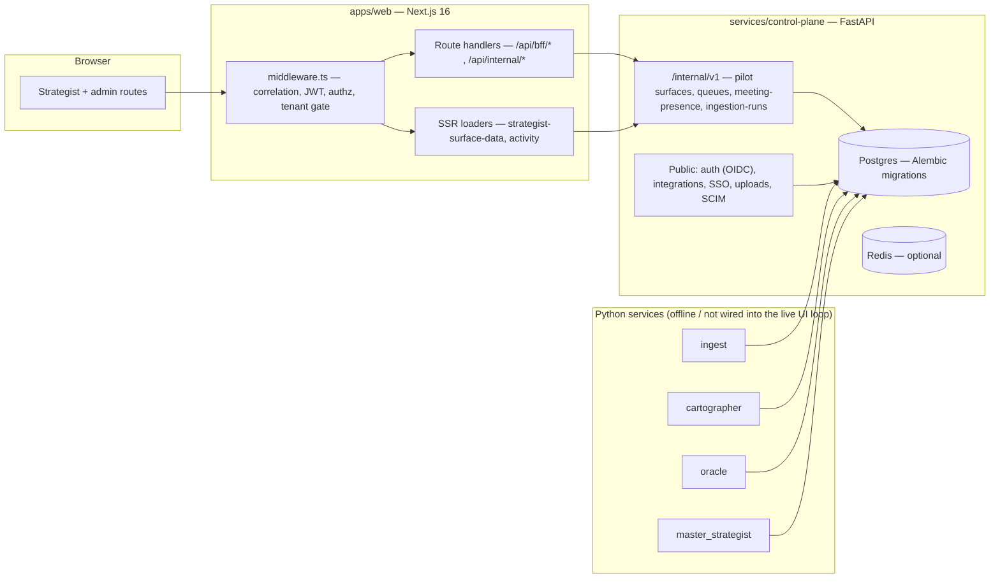

# DeployAI — Source of Truth

**The single canonical reference for DeployAI: product intent, architecture, real-vs-fixture status, and where to track delivery.**

| | |
| --- | --- |
| **Status** | Authoritative. Maintained going forward. |
| **Audience** | Engineers (esp. anyone taking the codebase over), PM/GTM, hosting operators, leadership. |
| **Last verified against code** | 2026-05-21 (commit `c21e9b4`, branch `main`). |
| **Delivery tracking** | [`_bmad-output/implementation-artifacts/sprint-status.yaml`](../../_bmad-output/implementation-artifacts/sprint-status.yaml) — honest epic-level status, kept in sync with this doc. |
| **Supersedes** | `whats-actually-here.md`, `pm-functionality-and-direction-brief.md`, and the BMAD planning artifacts (`prd.md`, `architecture.md`, `epics.md`, the product briefs, `ux-design-specification.md`, `mvp-operating-plan-2026.md`, `implementation-readiness-report-*`). All are archived under [`docs/archive/`](../archive/) for history. |

**The rule:** when this document and the code disagree, **the code wins** — fix the document. When this document and any archived planning artifact disagree, **this document wins**. Every claim here was checked against the repository at the commit above; sections that describe intent rather than shipped behavior say so explicitly.

---

## 1. What DeployAI is

DeployAI is an **agentic Deployment System of Record** — durable, cited memory for long-cycle, high-stakes customer deployments (municipal and regulated-enterprise accounts running 12–36 months).

**The problem it targets.** A long-cycle deployment's real operating system runs in one person's head — the deployment strategist who is simultaneously project manager, account manager, and customer-success engineer. When that person rotates out, or simply forgets, the deployment loses its memory: skipped calibrations, stakeholder turnover, and unrecorded commitments turn into expensive failures months later.

**The intended solution.** Convert every meeting, email, call, and field note for an account into a canonical, queryable store — an immutable event log, a time-versioned identity/stakeholder graph, and a library of "solidified learnings" with evidence snapshots. Agents are *retrieval-bound*: they may only surface or propose facts that trace back to a stored event, with a mandatory **citation envelope** on every output. Strategist-facing surfaces (morning digest, phase tracking, in-meeting alerts, queues) project that memory at the moment it is needed.

**Who it serves.** The primary user is the **deployment strategist** (also called a Forward Deployed Engineer / deployment lead at peer companies). The first intended deployment is the founder's own NYC DOT hardware engagement; peer GovTech vendors are the next intended customers. See archived [`product-brief-DeployAI.md`](../archive/product-brief-DeployAI.md) for the full GTM and commercial model.

**Important scope note for engagement/portfolio tracking.** DeployAI is architected as **deep single-account memory: one tenant models one deployment**, sitting in one phase of a 7-phase framework (see §6, §12). There is **no first-class "engagement" or portfolio entity**, no per-strategist roster of multiple engagements, and no cross-deployment roll-up. A cross-deployment view is *explicitly deferred* by the product brief ("waits for N ≥ 3 real deployments"), and the Timeline surface is a post-V1 (Epic 14) backlog item. A team that needs to track *many* engagements across *many* strategists would build that portfolio/team layer on top of this per-engagement substrate — it does not exist today.

---

## 2. V1 scope

**In scope for V1** (per the product brief; this is *intent*, not a completion claim — see §3):

- Strategist surfaces: Morning Digest, In-Meeting Alert, Phase & Task Tracking, Evening Synthesis, Action / Validation / Solidification queues, Evidence deep links, Overrides, Personal Audit, Integrations settings.
- Canonical memory: event log, time-versioned identity graph, solidified-learning library, tombstones, action/validation queues.
- Three-agent runtime: Cartographer, Oracle, Master Strategist (internal — no user UI in V1).
- Seven-phase deployment state machine with agent-proposed, human-confirmed transitions.
- Ingestion: M365 calendar/email, Teams transcript import, voice/meeting file upload, manual notes.
- Edge capture agent (Tauri macOS) and a Go FOIA CLI.

**Explicitly out of V1** (architected, not engineered):

- **Cross-deployment / portfolio analytics dashboard** — waits for N ≥ 3 real deployments.
- **Timeline / Visibility surface** — deferred to Epic 14 (post-V1).
- Live multi-agent negotiation trace UI; standalone Blocker dashboard; advanced calibration tooling.
- Successor-strategist inheritance *active role* (data model is V1, the role activates V1.5).

**Never to build:** competitive intelligence, external-threat mapping, vendor-tracking. DeployAI is a deployment-strategist tool, not a market-intelligence product.

---

## 3. Maturity — honest status

Read this before trusting any "done" label anywhere in the repo.

- **This codebase was generated with the BMAD method** (an AI-agent-driven development framework — see the agent personas under [`.cursor/skills/`](../../.cursor/skills/)). The 16-epic / ~95-story / "23-week" roadmap was produced by a single author across ~3 weeks of commit activity. The "week" labels in the roadmap are planning fiction, not elapsed engineering time.
- **"Done" in BMAD artifacts means "story acceptance criteria met / CI green," not "production feature."** Many epics marked `done` deliver production-*shaped* UI on **fixture or stubbed data**. The honest tracker ([`sprint-status.yaml`](../../_bmad-output/implementation-artifacts/sprint-status.yaml)) reclassifies these — use it, not the BMAD story files.
- **What is genuinely solid:** the engineering scaffolding — typed Next.js + FastAPI code, async SQLAlchemy + Alembic migrations with tenant RLS, a working Anthropic/OpenAI LLM client, 13 CI workflows, SBOM/CVE scanning, accessibility gates, cross-tenant isolation fuzz tests, ~141 test files. Code quality is consistent and clean.
- **What is demo-grade:** digest/evening data (fixtures or optional HTTP feeds), meeting presence (a stub), the "agentic" layer (deterministic Python heuristics, no live LLM-driven loop into the UI — see §11). There is no running agent that ingests meetings and updates surfaces.
- **Overall:** a credible, well-engineered **prototype skeleton** — better scaffolding than most prototypes, but a prototype. It is **demo-usable**, not **pilot-usable** or **production-usable** (see §13 for the precise distinction).

---

## 4. Architecture — as built

Polyglot monorepo: **pnpm + Turborepo** workspaces, **Python (uv)** services, a **Go** CLI, a **Rust/Tauri** desktop app. ~49k lines of code.

**Workspace map:**

| Path | Role | Reality |
| --- | --- | --- |
| `apps/web` | Next.js 16 App Router — strategist + admin routes, BFF/internal route handlers, middleware. | Real, the most complete workspace. |
| `apps/edge-agent` | Tauri macOS edge capture agent (Rust + Vite). | Scaffold + capability model; continuous audio capture is a follow-up. |
| `apps/foia-cli` | Go static CLI for FOIA bundle verification. | Real but small (~11 Go files). |
| `apps/eval` | Replay-parity / evaluation harness (rule + LLM-judge evaluators). | Real harness; not wired to a production agent loop. |
| `apps/tools/vpat-aggregator` | VPAT accessibility evidence aggregator. | Helper tool. |
| `services/control-plane` | FastAPI control plane — auth, integrations, internal APIs, all DB-backed strategist data. | Real; the backend of record. |
| `services/ingest`, `cartographer`, `oracle`, `master_strategist` | Python "agent" services. | Deterministic logic + contracts; **not** wired into a live browser loop (see §11). |
| `services/_shared` | Shared Python: `tenancy`, `authz`, `citation`, `checkpointer`, `runtime`, `tsa`. | Real shared libraries. |
| `packages/*` | `authz`, `contracts` (citation envelope), `shared-ui`, `design-tokens`, `foia-verifier`, `llama-citation-adapter`, `llm-provider`(`-py`). | Real; consumed by web + services. |
| `infra/compose` | Docker Compose reference stack. | Real; the only deployment artifact (see §5). |
| `migrations`, `services/control-plane/alembic` | Schema migrations. | Real; 16 Alembic versions. |

---

## 5. Intended architecture vs as-built

The archived [`architecture.md`](../archive/architecture.md) describes a far heavier production posture than what exists. A successor must not assume any of the following is present:

| Archived architecture.md says | Actually in the repo |
| --- | --- |
| AWS: ECS Fargate, RDS Multi-AZ, ALB+WAF, S3, ElastiCache, SQS, EventBridge, Secrets Manager, KMS. | **None.** No cloud infra. Deployment artifact is `infra/compose/docker-compose.yml` only. |
| Terraform + Terragrunt IaC. | **No `.tf` files exist.** |
| Bifurcated database (separate clusters / encryption domains). | Single Postgres. Logical scoping via `tenant_id` + RLS. |
| Every agent is a LangGraph state machine (`graph.py` per service). | No LangGraph state machines. Cartographer has `stub_graph.py` / `degradation_graph.py`; agents are plain Python. |
| Grafana/Loki/Tempo/Prometheus + OnCall observability. | Not present. CP exposes `/healthz`; correlation IDs are stamped. |
| FIPS modules, KMS envelope encryption, RFC 3161 TSA in the live path. | KMS DEK path raises "not implemented"; FreeTSA exists as a compose stub. |
| Services split as `api-gateway`, `canonical-memory`, etc. | Collapsed into one `control-plane` service. |

The compose stack runs six services: `postgres`, `redis`, `minio`, `freetsa-stub`, `control-plane`, `web`. Treat `architecture.md` as a **design aspiration / target state**, not a description of the system.

---

## 6. Data model

Schema lives in [`services/control-plane/alembic/versions/`](../../services/control-plane/alembic/versions/) (16 migrations) and the SQLAlchemy models under `services/control-plane/src/control_plane/domain/`. ~23 tables; tenant isolation via mandatory `tenant_id` + Postgres Row-Level Security policies (`20260422_0002_tenant_rls_policies.py`).

**Core groups:**

- **Canonical memory** — `canonical_memory_events` (immutable event log), `identity_nodes` + `identity_attribute_history` + `identity_supersessions` (time-versioned stakeholder graph), `solidified_learnings` + `learning_lifecycle_states`, `tombstones`, `schema_proposals`.
- **Deployment state** — `tenant_deployment_phases` (one phase row per tenant), `phase_transition_proposals`.
- **Strategist work queues** — `strategist_action_queue_items`, `strategist_validation_queue_items`, `strategist_solidification_queue_items`, `strategist_activity_events`, `adjudication_queue_items`.
- **Override / audit** — `private_override_annotations`.
- **Identity / tenancy / integrations** — `app_tenants`, `app_users`, `integrations`, `edge_agents`, `break_glass_sessions`, `ingestion_runs`.

**The shape that matters most:** the unit of tenancy is **one tenant = one deployment/account**, and `tenant_deployment_phases` gives that tenant exactly one current phase. There is **no `engagement` table, no portfolio entity, and no user-to-many-engagements assignment.** This is the central architectural fact for anyone whose goal is multi-engagement / team tracking — see §1 scope note.

---

## 7. Strategist surfaces & data provenance

All surfaces under `apps/web/src/app/(strategist)/` render in the browser. **Data provenance is flag-driven** — the surface looking real does not mean the data is real. Verified against [`strategist-surface-data.ts`](../../apps/web/src/lib/strategist-data/strategist-surface-data.ts) and [`strategist-pilot-tenant.ts`](../../apps/web/src/lib/internal/strategist-pilot-tenant.ts).

| Surface | Default data | "More real" path |
| --- | --- | --- |
| `/digest` | `MORNING_DIGEST_TOP` fixture in code | `STRATEGIST_DIGEST_SOURCE_URL` (validated JSON) or CP pilot surface |
| `/phase-tracking` | Seeded fallback rows + banner | Remote feed wired to schema, or CP pilot surface |
| `/evening` | Mock slice + patterns; nudge count from CP queue | `STRATEGIST_EVENING_SYNTHESIS_SOURCE_URL` or CP pilot surface |
| `/in-meeting` | Activity poll + digest-aligned fixtures | CP `meeting-presence` (stub) + `?inMeeting=1` demo flag |
| `/action-queue` | **Postgres via CP** (empty until carryover/inserts) | needs `DEPLOYAI_CONTROL_PLANE_URL` + `DEPLOYAI_INTERNAL_API_KEY` + migrated DB |
| `/validation-queue` | **Postgres via CP** — auto-seeded with 10 **mock** rows on first tenant touch | same CP requirement |
| `/solidification-review` | **Postgres via CP** — auto-seeded with 20 **mock** rows on first tenant touch | same CP requirement |
| `/evidence/[nodeId]` | Works for fixture IDs linked from digest | needs a canonical graph backing the same IDs |
| `/overrides`, `/audit/personal` | BFF → CP durable overrides / activity APIs | CP migrated + tenant-scoped actor |
| Activity / degrade banners | `GET /api/internal/strategist-activity` → CP health + ingest + optional Oracle health URL | `DEPLOYAI_ORACLE_HEALTH_URL` (liveness only) |

**Key honesty points:**

- Queues are **always** Postgres-backed via CP — there is no in-memory web fallback. Without CP env + a migrated DB, queue routes return **503**.
- The CP queue rows for validation/solidification are **hardcoded mock seed data** (`"Validation candidate N: low-confidence extraction…"`), not real extractions.
- "Pilot surfaces" from CP are **operator-supplied JSON files** (`DEPLOYAI_PILOT_SURFACE_DATA_PATH`), not automatic canonical-memory projections. Canonical projections are types-only (`strategist-canonical-projections.ts`; flag `DEPLOYAI_STRATEGIST_CANONICAL_PROJECTIONS_STUB` reserved, not wired).

---

## 8. Identity & tenancy

Middleware: [`apps/web/middleware.ts`](../../apps/web/middleware.ts).

- Stamps `x-deployai-correlation-id` on inbound requests.
- With `DEPLOYAI_WEB_TRUST_JWT=1` + PEM: verifies an RS256 access JWT (issuer `deployai-control-plane`, audience `deployai`), sets `x-deployai-role` / `x-deployai-tenant` from claims; bad token → **401**. Optionally strips inbound role/tenant headers first (`DEPLOYAI_WEB_CLEAR_STRATEGIST_HEADERS_BEFORE_JWT=1`).
- **In `NODE_ENV=development`, injects `deployment_strategist`** when headers are missing — disable with `DEPLOYAI_DISABLE_DEV_STRATEGIST=1`.
- Runs `canAccess` from `@deployai/authz`; blocks `external_auditor` from strategist surfaces (403).
- With `DEPLOYAI_STRATEGIST_REQUIRE_TENANT=1`, strategist pages/APIs require `x-deployai-tenant` (403 if missing).
- Control plane implements OIDC and SCIM routes (`auth_oidc.py`, `scim.py`); **SAML is explicitly not implemented** (`auth_saml.py` returns "not implemented").

Production identity must replace dev role injection with real tenant SSO/session.

---

## 9. Queues & durability

- BFF queue handlers (`apps/web/src/app/api/bff/{action,validation,solidification}-queue/`) proxy to CP `/internal/v1/strategist/*-queue-items` ([`strategist_queues_internal.py`](../../services/control-plane/src/control_plane/api/routes/strategist_queues_internal.py)).
- **Fail-closed:** `strategist-queues-route-guard.ts` returns **503 `cp_misconfigured`** when CP URL/key is missing; CP unreachable → **502 `cp_error`**. No silent fallback.
- Queue state is **never** held in web-process memory — multi-replica web is safe for queue state when CP is healthy.

---

## 10. Meetings & presence

- CP endpoint `GET /internal/v1/strategist/meeting-presence?tenant_id=` ([`strategist_meeting_presence.py`](../../services/control-plane/src/control_plane/api/routes/strategist_meeting_presence.py)).
- Stub tenants listed in `DEPLOYAI_STUB_IN_MEETING_TENANT_IDS` return `in_meeting: true`; everyone else returns `in_meeting: false`, `detection_source: off`.
- **There is no live calendar/Graph integration for meeting presence.** The `/in-meeting` surface is driven by stub tenants or the `?inMeeting=1` URL demo flag (production-gated by `NEXT_PUBLIC_DEPLOYAI_STRATEGIST_MEETING_URL_DEMO=1`).

---

## 11. Intelligence / agent layer

The product is positioned as "agentic." Be precise about what that means today:

- **LLM client is real.** `packages/llm-provider-py` has working Anthropic (`claude-sonnet-4-20250514`) and OpenAI clients with retries and SSE streaming.
- **The "agents" are deterministic Python.** `master_strategist` "arbitration" is a weighted linear formula (`0.45·confidence + 0.35·phase_fit + 0.20·override_strength`). `oracle`, `cartographer`, `ingest` are likewise mostly deterministic logic and contracts/harnesses. Cartographer has a `stub_graph.py`.
- **There is no live agent loop.** Nothing ingests meetings, runs the LLM, and updates strategist surfaces in real time. "Activity poll" is not an agent stream.
- The replay-parity / evaluation harness (`apps/eval`, `tests/continuity-of-reference/`) is real and runnable, but it tests contracts, not a production agent.

Treat the agent services as **a lab and a spec**, not a running intelligence layer.

---

## 12. The 7-phase deployment framework

Authoritative labels are in code — [`services/control-plane/src/control_plane/phases/machine.py`](../../services/control-plane/src/control_plane/phases/machine.py):

`P1_pre_engagement → P2_discovery → P3_ecosystem_mapping → P4_design → P5_pilot → P6_scale → P7_inheritance`

Transitions are strictly forward, one step at a time (`can_transition`). A tenant has exactly one current phase (`tenant_deployment_phases`).

**Doc-vs-code drift to be aware of:** the archived PRD (FR30) names the phases differently ("Pre-sale/Scoping, Preparation, Integration/Data Collection, User Training, Value Creation, Preparing for Expansion, Expansion"). The **code labels above are authoritative**; the PRD names are stale.

---

## 13. Deployment modes & configuration

Full env catalog: [`.env.example`](../../.env.example). Three modes:

| Mode | Posture | What you get |
| --- | --- | --- |
| **Local demo** | `NODE_ENV=development`, dev role injection on, sources unset. | Walk the UX on fixtures. Queues still need a running CP + migrated DB. |
| **Hosted pilot** | `DEPLOYAI_WEB_TRUST_JWT=1` + PEM; `DEPLOYAI_STRATEGIST_REQUIRE_TENANT=1`; CP URL + internal key; optional `DEPLOYAI_PILOT_TENANT_ID` / `DEPLOYAI_*_SOURCE=cp`. | SSO-shaped headers, tenant-scoped routes, Postgres queues, CP file-backed pilot surfaces. |
| **Production-shaped** | `NODE_ENV=production`; CP URL/key present; meeting URL demo off. | Fail-closed: queue routes 503 without CP. |

**Demo vs pilot vs production:**

- **Demo-usable** (today): walk the workflow with fixtures + dev role + a running CP for queues.
- **Pilot-usable** (not yet): same surfaces backed by durable per-tenant data, real SSO, real meeting signal, ingestion feeding the evidence graph.
- **Production-usable** (not yet): the above + a real agent loop driving updates, plus the operability/compliance work in Epic 12.

Run it locally: `pnpm install --frozen-lockfile` then `pnpm --filter @deployai/web dev`, or the full stack via `make dev` (see [`docs/dev-environment.md`](../dev-environment.md)).

---

## 14. Known gaps & risks

- **No portfolio / multi-engagement model** — the single largest gap for a team tracking many engagements (§1, §6).
- **No live agent loop** — surfaces do not update from model output (§11).
- **Meeting presence is a stub** — no calendar truth (§10).
- **Canonical-memory projections are unwired** — digest/evidence cannot be auto-materialized per tenant; pilot surfaces are operator JSON files (§7).
- **~131 stub / TODO / not-implemented markers in core code** — including SAML, S3-backed stores, KMS DEK encryption, real ASR transcription, the integration kill-switch.
- **Intended architecture is unbuilt** — no AWS, no IaC, no production observability (§5).
- **Epic 12 (FOIA / compliance / operability) is mostly backlog** — story 12-2 in review, 12-3…12-14 not started.
- **Doc-vs-code drift exists** — e.g. phase names (§12), CP correlation logging promised in `docs/production/correlation-ids-rollout.md` has no matching CP middleware. Keep this document as the reconciliation point.

---

## 15. Requirements & delivery tracking

- **Live status:** [`_bmad-output/implementation-artifacts/sprint-status.yaml`](../../_bmad-output/implementation-artifacts/sprint-status.yaml) — rewritten to honest, code-verified epic-level statuses. **This is the tracker to update as work lands.** Update it in the same PR that changes delivery status, and update §3/§7/§14 here if a surface moves from fixture to real.
- **Requirements baseline:** the PRD defined 79 functional requirements, 78 non-functional requirements, and 12 design-philosophy commitments (DP1–DP12). The full text is archived at [`docs/archive/prd.md`](../archive/prd.md); the epic→FR mapping at [`docs/archive/epics.md`](../archive/epics.md). These are a historical baseline, not a delivery promise.

---

## 16. Documentation map

This document is the canonical product/architecture reference. **Operational runbooks remain standalone** and are not duplicated here — find them below.

**Engineering & environment**
- [`docs/dev-environment.md`](../dev-environment.md) — toolchains, pnpm workflows, dev middleware, compose stack.
- [`docs/repo-layout.md`](../repo-layout.md) — detailed workspace map.
- [`docs/canonical-memory.md`](../canonical-memory.md) — canonical memory schema notes.
- [`docs/contracts/citation-envelope.md`](../contracts/citation-envelope.md) — citation envelope contract.
- [`docs/a11y-gates.md`](../a11y-gates.md), [`docs/design-tokens.md`](../design-tokens.md), [`docs/shadcn.md`](../shadcn.md), [`docs/design-system/governance.md`](../design-system/governance.md) — frontend/design system.
- [`docs/testing/`](../testing/) — golden corpus & fixtures.

**Identity, authz, security**
- [`docs/auth/`](../auth/) — SSO, SCIM, sessions setup.
- [`docs/authz/`](../authz/) — role matrix, RLS alignment.
- [`docs/security/`](../security/) — tenant isolation, cross-tenant fuzz.

**Pilot & operations**
- [`docs/pilot/`](../pilot/) — hosted pilot operator pack: `README.md`, `phase-0-checklist.md`, `hosted-environment.md`, `session-and-headers.md`, `support-runbook.md`, `queue-durability-modes.md`, and more.
- [`docs/production/`](../production/) — operations & release, Gate-1 verification, strategist data plane, runbooks.
- [`docs/human-ops-runbook.md`](../human-ops-runbook.md) — secrets, CI, release operations.
- [`docs/platform/`](../platform/) — account provisioning, break-glass, integration kill-switch.

**Specialized**
- [`docs/edge-agent/`](../edge-agent/) — Tauri agent capabilities & platform assessment.
- [`docs/foia/bundle-format.md`](../foia/bundle-format.md) — FOIA export bundle format.
- [`docs/compliance/nist-ai-rmf-mapping.md`](../compliance/nist-ai-rmf-mapping.md), [`docs/standards/agent-posture.md`](../standards/agent-posture.md).

**Archived (history only — superseded by this document)**
- [`docs/archive/`](../archive/) — the BMAD planning artifacts and prior product docs.

---

## 17. Changelog

| Date | Change |
| --- | --- |
| 2026-05-21 | **Consolidation.** This document established as the single source of truth, cross-referenced against code at `c21e9b4`. Absorbed `whats-actually-here.md`, `pm-functionality-and-direction-brief.md`, and the BMAD planning artifacts (archived under `docs/archive/`). `sprint-status.yaml` rewritten with honest, code-verified statuses. |

**Maintenance rule:** when code behavior changes, update this document and `sprint-status.yaml` in the same PR. When in doubt, verify against code and record the verification date in the header table.
