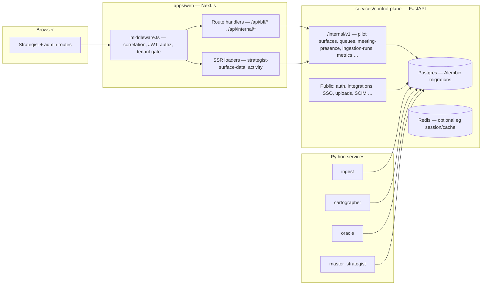

# DeployAI — canonical product & architecture spec (source of truth)

**Audience:** leadership, PM, hosting operators, engineers.  
**Rule:** This document **summarizes** other docs but must **not contradict** behavior in the repositories’ **current code**. When code and prose disagree, **trust the code** and treat older prose as historical unless it carries a “Superseded by…” note.

---

## Executive summary

DeployAI is a **polyglot monorepo** pairing a **Next.js strategist web app** (`apps/web`) with a **FastAPI control plane** (`services/control-plane`) and supporting Python services (ingest, cartographer, oracle, master_strategist), plus **edge** (Tauri) and **FOIA** (Go CLI / TS verifier) workspaces. Strategist UX (digest, phase, evening, in-meeting, queues, evidence, overrides, audit, integrations) is **real in the browser**; **data provenance is flag-driven**: fixtures, optional remote JSON URLs, **CP file-backed pilot surfaces**; **strategist queues are always Postgres-backed via CP** (BFF returns **503** if CP env is missing or unreachable). **Identity** for hosted pilots is designed around **JWT verification** (optional) or **trusted proxy headers**, with **optional tenant-required** enforcement. **Meeting presence** is **stub- or URL-demo-driven** until calendar/Graph depth lands; **live agent streaming into the UI is not** the current loop. **Operational truth** for story completion lives in **`_bmad-output/implementation-artifacts/sprint-status.yaml`**; this spec **does not replace** that file for delivery status.

---

## Product intent & deployment modes (from code flags)

| Mode | Typical flags / posture | What you get |
| --- | --- | --- |
| **Local demo** | Default or unset strategist sources; `NODE_ENV=development`; optional `DEPLOYAI_DISABLE_DEV_STRATEGIST` off → dev role injection | Walk UX with fixtures; **queues require running CP** (`DEPLOYAI_CONTROL_PLANE_URL` + `DEPLOYAI_INTERNAL_API_KEY` + migrated DB); URL demo overlays for meeting/degraded banners |
| **Hosted pilot / staging-shaped** | `DEPLOYAI_WEB_TRUST_JWT=1` + PEM; optionally `DEPLOYAI_WEB_CLEAR_STRATEGIST_HEADERS_BEFORE_JWT=1`; `DEPLOYAI_STRATEGIST_REQUIRE_TENANT=1`; `DEPLOYAI_CONTROL_PLANE_URL` / `NEXT_PUBLIC_CONTROL_PLANE_URL` + `DEPLOYAI_INTERNAL_API_KEY`; pilot tenant / `DEPLOYAI_*_SOURCE=cp` as needed | SSO-shaped headers, tenant-scoped strategist routes, CP internal APIs for activity and **Postgres queues**, pilot JSON file via `DEPLOYAI_PILOT_SURFACE_DATA_PATH` on CP |
| **Production-shaped hardening** | `NODE_ENV=production`; CP URL/key present for queues; **no** `NEXT_PUBLIC_DEPLOYAI_STRATEGIST_MEETING_URL_DEMO` unless deliberate | BFF queue routes return **503** when CP URL/key missing (**no** web-tier memory fallback) |

Primary env catalog: **[`.env.example`](../../.env.example)** (sections for control plane and `apps/web`). Living “fixture vs live” narration: **[`whats-actually-here.md`](../../whats-actually-here.md)**.

---

## Architecture

**Apps (pnpm / turbo participants):**

- **`apps/web`** — Strategist-facing Next.js App Router (`src/app`), BFF and internal route handlers (`src/app/api`), middleware at repo-relative **`apps/web/middleware.ts`**.
- **`apps/edge-agent`** — Tauri macOS edge capture agent (V1 scoped stories per BMAD sprint grid).
- **`apps/foia-cli`** — Go static CLI (`cmd/foia`).
- **`apps/eval`** — Evaluation / replay-parity tooling (root scripts delegate via turbo).
- **`apps/tools/vpat-aggregator`** — VPAT evidence aggregation helper.

**Services (`services/` on disk):** `control-plane`, `ingest`, `cartographer`, `oracle`, `master_strategist`; plus **`services/_shared/`** Python packages (`tenancy`, `authz`, `citation`, `checkpointer`, `runtime`, `tsa`).

**Packages (`packages/`):**

| Package | Role (strategist / CP contracts) |
| --- | --- |
| `@deployai/authz` | V1 role → action/resource checks consumed by **`apps/web/middleware.ts`** and BFF handlers |
| `@deployai/contracts` | Citation envelope and shared TS types |
| `@deployai/shared-ui` | Strategist primitives (evidence panel, citations, queues cards, banners, …) |
| `@deployai/design-tokens` | Design system tokens wired into web |

---

## Identity & tenancy

- **Middleware** (**[`apps/web/middleware.ts`](../../apps/web/middleware.ts)**): stamps **`x-deployai-correlation-id`** (**[`correlation-id.ts`](../../apps/web/src/lib/internal/correlation-id.ts)**); optionally **strips** inbound `x-deployai-role` / `x-deployai-tenant` when **`DEPLOYAI_WEB_CLEAR_STRATEGIST_HEADERS_BEFORE_JWT=1`** with JWT trust (**[`strategist-header-strip-before-jwt.ts`](../../apps/web/src/lib/internal/strategist-header-strip-before-jwt.ts)**); applies **JWT** when **`DEPLOYAI_WEB_TRUST_JWT=1`** + PEM — sets **`x-deployai-role`** and **`x-deployai-tenant`** from claims **`tid`** and roles (**[`deployai-access-jwt.ts`](../../apps/web/src/lib/internal/deployai-access-jwt.ts)**); rejects bad tokens with **401**; in **development**, default-injects **`deployment_strategist`** unless **`DEPLOYAI_DISABLE_DEV_STRATEGIST=1`**; runs **`canAccess`** from **`@deployai/authz`** for strategist and admin paths; **blocks `external_auditor`** from strategist surfaces (explicit 403 message); when **`DEPLOYAI_STRATEGIST_REQUIRE_TENANT=1`**, strategist pages and listed APIs require **`x-deployai-tenant`** (**403** if missing).
- **Assumptions:** Access JWT is **RS256**, issuer default **`deployai-control-plane`**, audience default **`deployai`**, optional **`token_use: access`** — matched in **`deployai-access-jwt.ts`** to control-plane issuance story.
- **Control plane:** Public OIDC/SAML/SCIM and tenant-scoped DB sessions are implemented in routers included from **`services/control-plane/src/control_plane/main.py`** — this spec does not enumerate every auth endpoint; see that file’s `include_router` list.

---

## Strategist UX surfaces

**Route groups (App Router):** **`src/app/(strategist)/…`** — `digest`, `phase-tracking`, `evening`, `in-meeting`, `action-queue`, `validation-queue`, `solidification-review`, `evidence/[nodeId]`, `overrides`, `audit/personal`, `settings/integrations`; **`src/app/(internal)/admin/…`** for admin stubs/shells. Layout wires **[`StrategistShell.client.tsx`](../../apps/web/src/app/(strategist)/StrategistShell.client.tsx)** with initial activity from **`loadStrategistActivityForActor`** and pilot onboarding (**Epic 16.1**).

**Data sources (verified in [`strategist-surface-data.ts`](../../apps/web/src/lib/strategist-data/strategist-surface-data.ts) + [`strategist-pilot-tenant.ts`](../../apps/web/src/lib/internal/strategist-pilot-tenant.ts)):**

| Surface | Mock / fixture path | CP path when `DEPLOYAI_*_SOURCE=cp` **or** pilot tenant (`DEPLOYAI_PILOT_TENANT_ID`) |
| --- | --- | --- |
| Morning digest | `MORNING_DIGEST_TOP`; or `STRATEGIST_DIGEST_SOURCE_URL` when **not** in CP mode | `GET /internal/v1/strategist/pilot-surfaces/morning-digest-top` |
| Phase tracking | Seeded fallback rows | `…/phase-tracking` |
| Evening | Mock slice + patterns; or `STRATEGIST_EVENING_SYNTHESIS_SOURCE_URL` | `…/evening-synthesis` |
| Evidence `nodeId` | `getStrategistEvidenceByNodeId` from mock package | `…/evidence/{node}` (pilot surface) |
| Activity / banners | N/A (BFF) | CP **`/healthz`**, **`/internal/v1/ingestion-runs`**, **`/internal/v1/strategist/meeting-presence`**, optional **`DEPLOYAI_ORACLE_HEALTH_URL`** |

**BFF / internal API routes (non-exhaustive):** under **`src/app/api/bff/`** — action-queue, validation-queue, solidification-queue, in-meeting-carryover, in-meeting-feedback, overrides, personal-audit, strategist-memory-search, integrations disable; under **`src/app/api/internal/`** — strategist-activity, ingestion-runs, schema-proposals.

**Tests that encode behavior:** e.g. **`strategist-surface-data.test.ts`**, **`strategist-queues-backend.test.ts`**, **`deployai-access-jwt.test.ts`**, **`strategist-surface-flags`** / **`strategist-url-demo-policy`** — see `apps/web/src` search for filenames.

---

## Queues & durability

- **Always CP:** BFF queue handlers proxy to **`/internal/v1/strategist/*-queue`** APIs (**[`strategist-queues-internal.py`](../../services/control-plane/src/control_plane/api/routes/strategist_queues_internal.py)**). Shared DTOs: [`apps/web/src/lib/bff/strategist-queue-types.ts`](../../apps/web/src/lib/bff/strategist-queue-types.ts).
- **Fail-closed:** **`strategist-queues-route-guard.ts`** returns **503** with `cp_misconfigured` when a **tenant-scoped** request hits a queue route but **`DEPLOYAI_CONTROL_PLANE_URL`** / **`DEPLOYAI_INTERNAL_API_KEY`** is missing (**[`strategist-queues-backend.ts`](../../apps/web/src/lib/internal/strategist-queues-backend.ts)**). CP unreachable → mapper returns **502** / **cp_error** (no silent fallback).
- **CP persistence:** strategist queue tables migrate with Alembic (e.g. **`20260527_0015_strategist_operator_queues.py`** among **`services/control-plane/alembic/versions/`**). Seeds for validation/solidification mirror first-touch auto-seed behavior when rows absent **in Postgres**.

---

## Meetings & presence

- **CP endpoint:** **`GET /internal/v1/strategist/meeting-presence?tenant_id=`** (**[`strategist_meeting_presence.py`](../../services/control-plane/src/control_plane/api/routes/strategist_meeting_presence.py)**). Stub tenants:**`DEPLOYAI_STUB_IN_MEETING_TENANT_IDS`** (comma UUIDs) → `in_meeting: true` with **`detection_source: oracle_signal`**. Default non-stub → **`in_meeting: false`**, **`detection_source: off`** (Graph/calendar deferred per module docstring).
- **Web merge:** **`loadStrategistActivityForActor`** forwards **`X-DeployAI-Correlation-Id`** on internal fetches (**[`load-strategist-activity.ts`](../../apps/web/src/lib/internal/load-strategist-activity.ts)**). Client shell merges **URL demo flags** (**[`mergeStrategistSurfaceFromDemoQuery`](../../apps/web/src/lib/epic8/strategist-surface-flags.ts)**): **`?inMeeting=1`** etc. In **production**, meeting URL demos require **`NEXT_PUBLIC_DEPLOYAI_STRATEGIST_MEETING_URL_DEMO=1`** (**[`strategist-url-demo-policy.ts`](../../apps/web/src/lib/epic8/strategist-url-demo-policy.ts)**).

---

## Data plane (digest, evening, evidence, projections)

| Capability | Real in code? | Notes |
| --- | --- | --- |
| Pilot JSON surfaces on CP | **Yes** | File path from **`DEPLOYAI_PILOT_SURFACE_DATA_PATH`**; served by **`strategist_pilot_surfaces.py`** |
| `STRATEGIST_*_SOURCE_URL` HTTP feeds | **Yes** | Optional; validated loaders with degraded banners (**`strategist-surface-data.ts`**) |
| Canonical-memory-backed digest/evidence **projections** for all tenants | **No (stub types only)** | **`strategist-canonical-projections.ts`** — explicit “not wired”; env flag **`DEPLOYAI_STRATEGIST_CANONICAL_PROJECTIONS_STUB`** reserved |

---

## Observability & ops

- **CP liveness:** **`GET /healthz`** and **`GET /health`** — **`services/control-plane/src/control_plane/main.py`**.
- **Correlation:** Next middleware stamps inbound correlation (**[`correlation-id.ts`](../../apps/web/src/lib/internal/correlation-id.ts)**); strategist activity + CP internal calls send **`X-DeployAI-Correlation-Id`**. **`docs/production/correlation-ids-rollout.md`** describes pilot rollout (**PS-O-102**). **Codebase check:** no dedicated **`deployai.internal_access`** logger or FastAPI middleware module appears under **`services/control-plane`** in this checkout — reconcile **documentation vs implementation** as part of ops hardening.
- **Gate 1 / runbooks:** **`docs/production/gate-1-dashboard-spec.md`**, **`docs/production/ci-hosted-gate-1.md`**, **`docs/pilot/phase-0-checklist.md`**, **`docs/production/operations-and-release.md`**.

---

## Compliance / epics pointer (status only)

**Authoritative grid:** [`_bmad-output/implementation-artifacts/sprint-status.yaml`](../../_bmad-output/implementation-artifacts/sprint-status.yaml). **Epic titles / stories:** [`_bmad-output/planning-artifacts/epics.md`](../../_bmad-output/planning-artifacts/epics.md).  
Below: **epic-level status** only (no story text rewritten).

| Epic | Status in `sprint-status.yaml` (as of file `last_updated`) |
| --- | --- |
| 1–11 | `done` |
| 12 | `in-progress` (FOIA/compliance track; story **12-2** in `review` per grid) |
| 13–14 | `backlog` |
| 15–16 | `done` |

---

## Known gaps & risks (honest)

- **Meeting signal** is **not** production calendar truth for most tenants (**`detection_source: off`** unless stub list). URL demo is **gated** in production.
- **Pilot digest/evidence/phase/evening** from CP are **file-backed** pilot surfaces, not full canonical-memory live projections for arbitrary tenants.
- **In-meeting feedback** posts **strategist activity** to CP (**[`in-meeting-feedback/route.ts`](../../apps/web/src/app/api/bff/in-meeting-feedback/route.ts)**); optional local **`pushInMeetingAudit`** in-memory buffer was removed with **`strategist-queues-store`**.
- **Strategist queues** are **never** held in web process memory — **multi-replica web** is safe for queue state **when CP is healthy**.

---

## Remaining specification & implementation work

Priorities inferred from **code vs docs** and **`sprint-status.yaml`** — reference IDs only.

### P0

- **Align CP-side correlation logging with `docs/production/correlation-ids-rollout.md`:** implement observable logging/metrics for **`/internal/v1`** correlated requests, **or** narrow the rollout doc to current behavior (**Lane O**, **PS-O-102** / **PS-O-105** themes).
- **Epic 12 — compliance/export:** **`12-2-foia-bundle-construction-four-hour-ten-gb`** is in **`review`**; downstream **12-3 … 12-14** remain **`backlog`** until picked up — track in **`sprint-status.yaml`** (FOIA/program risk).

### P1

- **Meeting presence depth:** **`detection_source: off`/stub vs Graph** — aligns with Epic **15.4 / 9.1** follow-up (**`meeting-presence-pilot-scope.md`**).
- **Hosted queue configuration guardrails:** runbooks/checklists (**`phase-0-checklist.md`**, **`queue-durability-modes.md`**) — CP URL/key + migrations required for queue surfaces.

### P2

- **Canonical projection pipeline:** **`strategist-canonical-projections.ts`** types + **`DEPLOYAI_STRATEGIST_CANONICAL_PROJECTIONS_STUB`** — no loader wiring (**production data plane depth**).

---

## Appendix: file index (high-signal)

**Web:** [`apps/web/middleware.ts`](../../apps/web/middleware.ts); [`apps/web/src/lib/internal/deployai-access-jwt.ts`](../../apps/web/src/lib/internal/deployai-access-jwt.ts); [`apps/web/src/lib/internal/load-strategist-activity.ts`](../../apps/web/src/lib/internal/load-strategist-activity.ts); [`apps/web/src/lib/internal/strategist-pilot-tenant.ts`](../../apps/web/src/lib/internal/strategist-pilot-tenant.ts); [`apps/web/src/lib/internal/strategist-queues-backend.ts`](../../apps/web/src/lib/internal/strategist-queues-backend.ts); [`apps/web/src/lib/bff/strategist-queue-types.ts`](../../apps/web/src/lib/bff/strategist-queue-types.ts); [`apps/web/src/lib/strategist-data/strategist-surface-data.ts`](../../apps/web/src/lib/strategist-data/strategist-surface-data.ts); [`apps/web/src/lib/strategist-data/strategist-canonical-projections.ts`](../../apps/web/src/lib/strategist-data/strategist-canonical-projections.ts); [`apps/web/src/lib/epic8/strategist-surface-flags.ts`](../../apps/web/src/lib/epic8/strategist-surface-flags.ts); [`apps/web/src/app/api/internal/strategist-activity/route.ts`](../../apps/web/src/app/api/internal/strategist-activity/route.ts); BFF queue routes under [`apps/web/src/app/api/bff/`](../../apps/web/src/app/api/bff/).

**Control plane:** [`services/control-plane/src/control_plane/main.py`](../../services/control-plane/src/control_plane/main.py); [`strategist_meeting_presence.py`](../../services/control-plane/src/control_plane/api/routes/strategist_meeting_presence.py); [`strategist_queues_internal.py`](../../services/control-plane/src/control_plane/api/routes/strategist_queues_internal.py); [`strategist_pilot_surfaces.py`](../../services/control-plane/src/control_plane/api/routes/strategist_pilot_surfaces.py); [`services/control-plane/alembic/versions/`](../../services/control-plane/alembic/versions/).

**Config / operator docs:** [`.env.example`](../../.env.example); [`whats-actually-here.md`](../../whats-actually-here.md); [`docs/pilot/README.md`](../pilot/README.md); [`docs/production/operations-and-release.md`](../production/operations-and-release.md); [`docs/production/parallel-agent-execution-plan.md`](../production/parallel-agent-execution-plan.md).

**BMAD:** [`_bmad-output/implementation-artifacts/sprint-status.yaml`](../../_bmad-output/implementation-artifacts/sprint-status.yaml); [`_bmad-output/planning-artifacts/epics.md`](../../_bmad-output/planning-artifacts/epics.md).
