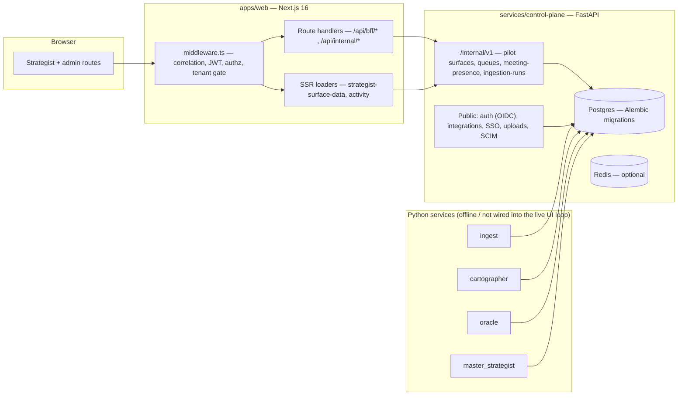

# DeployAI — Source of Truth

**The single canonical reference for DeployAI: product intent, architecture, real-vs-fixture status, and where to track delivery.**

| | |
| --- | --- |
| **Status** | Authoritative. Maintained going forward. |
| **Audience** | Engineers (esp. anyone taking the codebase over), PM/GTM, hosting operators, leadership. |
| **Last verified against code** | 2026-05-21 (commit `c21e9b4`, branch `main`). |
| **Delivery tracking** | [`_bmad-output/implementation-artifacts/sprint-status.yaml`](../../_bmad-output/implementation-artifacts/sprint-status.yaml) — honest epic-level status, kept in sync with this doc. |
| **Supersedes** | `whats-actually-here.md`, `pm-functionality-and-direction-brief.md`, and the BMAD planning artifacts (`prd.md`, `architecture.md`, `epics.md`, the product briefs, `ux-design-specification.md`, `mvp-operating-plan-2026.md`, `implementation-readiness-report-*`). All are archived under [`docs/archive/`](../archive/) for history. |

**The rule:** when this document and the code disagree, **the code wins** — fix the document. When this document and any archived planning artifact disagree, **this document wins**. Every claim here was checked against the repository at the commit above; sections that describe intent rather than shipped behavior say so explicitly.

---

## 1. What DeployAI is

DeployAI is an **agentic Deployment System of Record** — durable, cited memory for long-cycle, high-stakes customer deployments (municipal and regulated-enterprise accounts running 12–36 months).

**The problem it targets.** A long-cycle deployment's real operating system runs in one person's head — the deployment strategist who is simultaneously project manager, account manager, and customer-success engineer. When that person rotates out, or simply forgets, the deployment loses its memory: skipped calibrations, stakeholder turnover, and unrecorded commitments turn into expensive failures months later.

**The intended solution.** Convert every meeting, email, call, and field note for an account into a canonical, queryable store — an immutable event log, a time-versioned identity/stakeholder graph, and a library of "solidified learnings" with evidence snapshots. Agents are *retrieval-bound*: they may only surface or propose facts that trace back to a stored event, with a mandatory **citation envelope** on every output. Strategist-facing surfaces (morning digest, phase tracking, in-meeting alerts, queues) project that memory at the moment it is needed.

**Who it serves.** DeployAI serves a **cross-functional deployment team** — forward-deployed engineer, deployment strategist, and biz-dev lead — running long-cycle customer deployments together. It is built as **a product to sell** to such teams: an extensible base an adopting team's own engineers can tailor. (The original brief framed a single deployment strategist and a GovTech sales motion — see archived [`product-brief-DeployAI.md`](../archive/product-brief-DeployAI.md); the current direction and roadmap are **§16**.)

**Important scope note for engagement/portfolio tracking.** DeployAI was *originally* architected as **deep single-account memory** — one tenant modelling one deployment in one phase of a 7-phase framework (see §6, §12), with no first-class engagement entity. The **team-tracking pivot** (see **§16** — the live roadmap) has since changed that: it added a first-class **`engagement`** entity and an **`engagement_members`** join to the data model, plus the `/engagements` portfolio and per-engagement detail surfaces. As of Phase 4 the model is **tenant = team, engagement = one customer deployment** — a team can track many engagements, assign cross-functional members (FDE / deployment strategist / biz dev), and log role-attributed activity per engagement on real data. What remains ahead is the **re-scoped Phase 5–7 roadmap** (§16): converging the engagement layer onto canonical memory as a structured *map* (Phase 5), ingestion harnesses (Phase 6), and the agent-driven insight layer (Phase 7). The engagement layer is prototype-grade — see §3.

---

## 2. V1 scope

> **§16 supersedes this section for forward prioritization.** The lists below are the *original* product brief's V1 scope, kept for history and context; the live, re-scoped roadmap is **§16**.

**In scope for V1** (per the product brief; this is *intent*, not a completion claim — see §3):

- Strategist surfaces: Morning Digest, In-Meeting Alert, Phase & Task Tracking, Evening Synthesis, Action / Validation / Solidification queues, Evidence deep links, Overrides, Personal Audit, Integrations settings.
- Canonical memory: event log, time-versioned identity graph, solidified-learning library, tombstones, action/validation queues.
- Three-agent runtime: Cartographer, Oracle, Master Strategist (internal — no user UI in V1).
- Seven-phase deployment state machine with agent-proposed, human-confirmed transitions.
- Ingestion: M365 calendar/email, Teams transcript import, voice/meeting file upload, manual notes.
- Edge capture agent (Tauri macOS) and a Go FOIA CLI.

**Explicitly out of V1** (architected, not engineered):

- **Cross-deployment / portfolio analytics dashboard** — waits for N ≥ 3 real deployments.
- **Timeline / Visibility surface** — deferred to Epic 14 (post-V1).
- Live multi-agent negotiation trace UI; standalone Blocker dashboard; advanced calibration tooling.
- Successor-strategist inheritance *active role* (data model is V1, the role activates V1.5).

**Never to build:** competitive intelligence, external-threat mapping, vendor-tracking. DeployAI is a deployment-strategist tool, not a market-intelligence product.

---

## 3. Maturity — honest status

Read this before trusting any "done" label anywhere in the repo.

- **This codebase was generated with the BMAD method** (an AI-agent-driven development framework — see the agent personas under [`.cursor/skills/`](../../.cursor/skills/)). The 16-epic / ~95-story / "23-week" roadmap was produced by a single author across ~3 weeks of commit activity. The "week" labels in the roadmap are planning fiction, not elapsed engineering time.
- **"Done" in BMAD artifacts means "story acceptance criteria met / CI green," not "production feature."** Many epics marked `done` deliver production-*shaped* UI on **fixture or stubbed data**. The honest tracker ([`sprint-status.yaml`](../../_bmad-output/implementation-artifacts/sprint-status.yaml)) reclassifies these — use it, not the BMAD story files.
- **What is genuinely solid:** the engineering scaffolding — typed Next.js + FastAPI code, async SQLAlchemy + Alembic migrations with tenant RLS, a working Anthropic/OpenAI LLM client, 13 CI workflows, SBOM/CVE scanning, accessibility gates, cross-tenant isolation fuzz tests, ~141 test files. Code quality is consistent and clean.
- **What is demo-grade:** digest/evening data (fixtures or optional HTTP feeds), meeting presence (a stub), the "agentic" layer (deterministic Python heuristics, no live LLM-driven loop into the UI — see §11). There is no running agent that ingests meetings and updates surfaces.
- **Overall:** a credible, well-engineered **prototype skeleton** — better scaffolding than most prototypes, but a prototype. It is **demo-usable**, not **pilot-usable** or **production-usable** (see §13 for the precise distinction).

### Phase 0 verification — 2026-05-21

The §16 Phase 0 checklist was executed against commit `de8f3e0`.

**Works:**
- Toolchain matches the repo pins — Node 24.15.0, pnpm 10.33.0, Rust 1.95.0, Go 1.26.2, uv 0.11.7, Docker 29.4.0.
- `pnpm install --frozen-lockfile` — reproducible, no lockfile drift.
- `pnpm turbo run lint typecheck test build` — **67 / 67 tasks pass** (~42s): every workspace lints, typechecks, unit-tests, and builds clean (control-plane 114 unit tests, cartographer 47, etc.).
- `make dev` — all 6 containers (postgres, redis, minio, freetsa-stub, control-plane, web) build and come up healthy; `make dev-verify` green; the demo seed loads 24 `fixtures.canonical_events`.
- All 10 strategist pages render (HTTP 200) through the web shell.

**Broken / gaps:**
- **The compose stack did not migrate the application database.** Postgres contained only the `fixtures` demo schema — no `alembic_version` table and none of the app tables. Root cause: nothing ran `alembic upgrade`, `alembic.ini` carried only a placeholder `sqlalchemy.url`, and `alembic/env.py` did not read `DATABASE_URL`. Compounding it, the control-plane runtime image shipped with **no Postgres driver at all** (`asyncpg` absent from dependencies; `psycopg` dev-only) — so even a migrated database would have been unreachable.
- **Consequently all three BFF strategist-queue routes returned 502** (`cp_error`). Queue *pages* render, but their data layer failed.
- `/evidence/[nodeId]` 404s for IDs absent from the (unmigrated) graph.
- The control-plane integration tests (76 deselected from the unit run — they need testcontainers) were not exercised in this pass.

**Resolved — Phase 0.5 (this PR).** The data layer is now wired: `asyncpg` + `psycopg` are runtime dependencies; `alembic/env.py` honors `DATABASE_URL`; the Dockerfile ships the migration scripts; and a one-shot `migrate` compose service runs `alembic upgrade head` (via the sync `psycopg` driver — `asyncpg` cannot execute the migrations' multi-statement DDL) before the control plane starts. Verified: all 16 migrations apply and the BFF strategist-queue routes return live Postgres data (200) instead of 502. The Phase 1 `Engagement` migration can now build on a working path.

---

## 4. Architecture — as built

Polyglot monorepo: **pnpm + Turborepo** workspaces, **Python (uv)** services, a **Go** CLI, a **Rust/Tauri** desktop app. ~49k lines of code.

**Workspace map:**

| Path | Role | Reality |
| --- | --- | --- |
| `apps/web` | Next.js 16 App Router — strategist + admin routes, BFF/internal route handlers, middleware. | Real, the most complete workspace. |
| `apps/edge-agent` | Tauri macOS edge capture agent (Rust + Vite). | Scaffold + capability model; continuous audio capture is a follow-up. |
| `apps/foia-cli` | Go static CLI for FOIA bundle verification. | Real but small (~11 Go files). |
| `apps/eval` | Replay-parity / evaluation harness (rule + LLM-judge evaluators). | Real harness; not wired to a production agent loop. |
| `apps/tools/vpat-aggregator` | VPAT accessibility evidence aggregator. | Helper tool. |
| `services/control-plane` | FastAPI control plane — auth, integrations, internal APIs, all DB-backed strategist data. | Real; the backend of record. |
| `services/ingest`, `cartographer`, `oracle`, `master_strategist` | Python "agent" services. | Deterministic logic + contracts; **not** wired into a live browser loop (see §11). |
| `services/_shared` | Shared Python: `tenancy`, `authz`, `citation`, `checkpointer`, `runtime`, `tsa`. | Real shared libraries. |
| `packages/*` | `authz`, `contracts` (citation envelope), `shared-ui`, `design-tokens`, `foia-verifier`, `llama-citation-adapter`, `llm-provider`(`-py`). | Real; consumed by web + services. |
| `infra/compose` | Docker Compose reference stack. | Real; the only deployment artifact (see §5). |
| `migrations`, `services/control-plane/alembic` | Schema migrations. | Real; 16 Alembic versions. |

---

## 5. Intended architecture vs as-built

The archived [`architecture.md`](../archive/architecture.md) describes a far heavier production posture than what exists. A successor must not assume any of the following is present:

| Archived architecture.md says | Actually in the repo |
| --- | --- |
| AWS: ECS Fargate, RDS Multi-AZ, ALB+WAF, S3, ElastiCache, SQS, EventBridge, Secrets Manager, KMS. | **None.** No cloud infra. Deployment artifact is `infra/compose/docker-compose.yml` only. |
| Terraform + Terragrunt IaC. | **No `.tf` files exist.** |
| Bifurcated database (separate clusters / encryption domains). | Single Postgres. Logical scoping via `tenant_id` + RLS. |
| Every agent is a LangGraph state machine (`graph.py` per service). | No LangGraph state machines. Cartographer has `stub_graph.py` / `degradation_graph.py`; agents are plain Python. |
| Grafana/Loki/Tempo/Prometheus + OnCall observability. | Not present. CP exposes `/healthz`; correlation IDs are stamped. |
| FIPS modules, KMS envelope encryption, RFC 3161 TSA in the live path. | KMS DEK path raises "not implemented"; FreeTSA exists as a compose stub. |
| Services split as `api-gateway`, `canonical-memory`, etc. | Collapsed into one `control-plane` service. |

The compose stack runs six services: `postgres`, `redis`, `minio`, `freetsa-stub`, `control-plane`, `web`. Treat `architecture.md` as a **design aspiration / target state**, not a description of the system.

---

## 6. Data model

Schema lives in [`services/control-plane/alembic/versions/`](../../services/control-plane/alembic/versions/) (16 migrations) and the SQLAlchemy models under `services/control-plane/src/control_plane/domain/`. ~23 tables; tenant isolation via mandatory `tenant_id` + Postgres Row-Level Security policies (`20260422_0002_tenant_rls_policies.py`).

**Core groups:**

- **Canonical memory** — `canonical_memory_events` (immutable event log), `identity_nodes` + `identity_attribute_history` + `identity_supersessions` (time-versioned stakeholder graph), `solidified_learnings` + `learning_lifecycle_states`, `tombstones`, `schema_proposals`.
- **Deployment state** — `tenant_deployment_phases` (one phase row per tenant), `phase_transition_proposals`.
- **Strategist work queues** — `strategist_action_queue_items`, `strategist_validation_queue_items`, `strategist_solidification_queue_items`, `strategist_activity_events`, `adjudication_queue_items`.
- **Override / audit** — `private_override_annotations`.
- **Identity / tenancy / integrations** — `app_tenants`, `app_users`, `integrations`, `edge_agents`, `break_glass_sessions`, `ingestion_runs`.

**The shape that matters most:** the unit of tenancy is **one tenant = one deployment/account**, and `tenant_deployment_phases` gives that tenant exactly one current phase. There is **no `engagement` table, no portfolio entity, and no user-to-many-engagements assignment.** This is the central architectural fact for anyone whose goal is multi-engagement / team tracking — see §1 scope note.

---

## 7. Strategist surfaces & data provenance

All surfaces under `apps/web/src/app/(strategist)/` render in the browser. **Data provenance is flag-driven** — the surface looking real does not mean the data is real. Verified against [`strategist-surface-data.ts`](../../apps/web/src/lib/strategist-data/strategist-surface-data.ts) and [`strategist-pilot-tenant.ts`](../../apps/web/src/lib/internal/strategist-pilot-tenant.ts).

| Surface | Default data | "More real" path |
| --- | --- | --- |
| `/digest` | `MORNING_DIGEST_TOP` fixture in code | `STRATEGIST_DIGEST_SOURCE_URL` (validated JSON) or CP pilot surface |
| `/phase-tracking` | Seeded fallback rows + banner | Remote feed wired to schema, or CP pilot surface |
| `/evening` | Mock slice + patterns; nudge count from CP queue | `STRATEGIST_EVENING_SYNTHESIS_SOURCE_URL` or CP pilot surface |
| `/in-meeting` | Activity poll + digest-aligned fixtures | CP `meeting-presence` (stub) + `?inMeeting=1` demo flag |
| `/action-queue` | **Postgres via CP** (empty until carryover/inserts) | needs `DEPLOYAI_CONTROL_PLANE_URL` + `DEPLOYAI_INTERNAL_API_KEY` + migrated DB |
| `/validation-queue` | **Postgres via CP** — auto-seeded with 10 **mock** rows on first tenant touch | same CP requirement |
| `/solidification-review` | **Postgres via CP** — auto-seeded with 20 **mock** rows on first tenant touch | same CP requirement |
| `/evidence/[nodeId]` | Works for fixture IDs linked from digest | needs a canonical graph backing the same IDs |
| `/overrides`, `/audit/personal` | BFF → CP durable overrides / activity APIs | CP migrated + tenant-scoped actor |
| Activity / degrade banners | `GET /api/internal/strategist-activity` → CP health + ingest + optional Oracle health URL | `DEPLOYAI_ORACLE_HEALTH_URL` (liveness only) |

**Key honesty points:**

- Queues are **always** Postgres-backed via CP — there is no in-memory web fallback. Without CP env + a migrated DB, queue routes return **503**.
- The CP queue rows for validation/solidification are **hardcoded mock seed data** (`"Validation candidate N: low-confidence extraction…"`), not real extractions.
- "Pilot surfaces" from CP are **operator-supplied JSON files** (`DEPLOYAI_PILOT_SURFACE_DATA_PATH`), not automatic canonical-memory projections. Canonical projections are types-only (`strategist-canonical-projections.ts`; flag `DEPLOYAI_STRATEGIST_CANONICAL_PROJECTIONS_STUB` reserved, not wired).

---

## 8. Identity & tenancy

Middleware: [`apps/web/middleware.ts`](../../apps/web/middleware.ts).

- Stamps `x-deployai-correlation-id` on inbound requests.
- With `DEPLOYAI_WEB_TRUST_JWT=1` + PEM: verifies an RS256 access JWT (issuer `deployai-control-plane`, audience `deployai`), sets `x-deployai-role` / `x-deployai-tenant` from claims; bad token → **401**. Optionally strips inbound role/tenant headers first (`DEPLOYAI_WEB_CLEAR_STRATEGIST_HEADERS_BEFORE_JWT=1`).
- **In `NODE_ENV=development`, injects `deployment_strategist`** when headers are missing — disable with `DEPLOYAI_DISABLE_DEV_STRATEGIST=1`.
- Runs `canAccess` from `@deployai/authz`; blocks `external_auditor` from strategist surfaces (403).
- With `DEPLOYAI_STRATEGIST_REQUIRE_TENANT=1`, strategist pages/APIs require `x-deployai-tenant` (403 if missing).
- Control plane implements OIDC and SCIM routes (`auth_oidc.py`, `scim.py`); **SAML is explicitly not implemented** (`auth_saml.py` returns "not implemented").

Production identity must replace dev role injection with real tenant SSO/session.

---

## 9. Queues & durability

- BFF queue handlers (`apps/web/src/app/api/bff/{action,validation,solidification}-queue/`) proxy to CP `/internal/v1/strategist/*-queue-items` ([`strategist_queues_internal.py`](../../services/control-plane/src/control_plane/api/routes/strategist_queues_internal.py)).
- **Fail-closed:** `strategist-queues-route-guard.ts` returns **503 `cp_misconfigured`** when CP URL/key is missing; CP unreachable → **502 `cp_error`**. No silent fallback.
- Queue state is **never** held in web-process memory — multi-replica web is safe for queue state when CP is healthy.

---

## 10. Meetings & presence

- CP endpoint `GET /internal/v1/strategist/meeting-presence?tenant_id=` ([`strategist_meeting_presence.py`](../../services/control-plane/src/control_plane/api/routes/strategist_meeting_presence.py)).
- Stub tenants listed in `DEPLOYAI_STUB_IN_MEETING_TENANT_IDS` return `in_meeting: true`; everyone else returns `in_meeting: false`, `detection_source: off`.
- **There is no live calendar/Graph integration for meeting presence.** The `/in-meeting` surface is driven by stub tenants or the `?inMeeting=1` URL demo flag (production-gated by `NEXT_PUBLIC_DEPLOYAI_STRATEGIST_MEETING_URL_DEMO=1`).

---

## 11. Intelligence / agent layer

The product is positioned as "agentic." Be precise about what that means today:

- **LLM client is real.** `packages/llm-provider-py` has working Anthropic (`claude-sonnet-4-20250514`) and OpenAI clients with retries and SSE streaming.
- **The "agents" are deterministic Python.** `master_strategist` "arbitration" is a weighted linear formula (`0.45·confidence + 0.35·phase_fit + 0.20·override_strength`). `oracle`, `cartographer`, `ingest` are likewise mostly deterministic logic and contracts/harnesses. Cartographer has a `stub_graph.py`.
- **There is no live agent loop.** Nothing ingests meetings, runs the LLM, and updates strategist surfaces in real time. "Activity poll" is not an agent stream.
- The replay-parity / evaluation harness (`apps/eval`, `tests/continuity-of-reference/`) is real and runnable, but it tests contracts, not a production agent.

Treat the agent services as **a lab and a spec**, not a running intelligence layer.

---

## 12. The 7-phase deployment framework

Authoritative labels are in code — [`services/control-plane/src/control_plane/phases/machine.py`](../../services/control-plane/src/control_plane/phases/machine.py):

`P1_pre_engagement → P2_discovery → P3_ecosystem_mapping → P4_design → P5_pilot → P6_scale → P7_inheritance`

Transitions are strictly forward, one step at a time (`can_transition`). A tenant has exactly one current phase (`tenant_deployment_phases`).

**Doc-vs-code drift to be aware of:** the archived PRD (FR30) names the phases differently ("Pre-sale/Scoping, Preparation, Integration/Data Collection, User Training, Value Creation, Preparing for Expansion, Expansion"). The **code labels above are authoritative**; the PRD names are stale.

---

## 13. Deployment modes & configuration

Full env catalog: [`.env.example`](../../.env.example). Three modes:

| Mode | Posture | What you get |
| --- | --- | --- |
| **Local demo** | `NODE_ENV=development`, dev role injection on, sources unset. | Walk the UX on fixtures. Queues still need a running CP + migrated DB. |
| **Hosted pilot** | `DEPLOYAI_WEB_TRUST_JWT=1` + PEM; `DEPLOYAI_STRATEGIST_REQUIRE_TENANT=1`; CP URL + internal key; optional `DEPLOYAI_PILOT_TENANT_ID` / `DEPLOYAI_*_SOURCE=cp`. | SSO-shaped headers, tenant-scoped routes, Postgres queues, CP file-backed pilot surfaces. |
| **Production-shaped** | `NODE_ENV=production`; CP URL/key present; meeting URL demo off. | Fail-closed: queue routes 503 without CP. |

**Demo vs pilot vs production:**

- **Demo-usable** (today): walk the workflow with fixtures + dev role + a running CP for queues.
- **Pilot-usable** (not yet): same surfaces backed by durable per-tenant data, real SSO, real meeting signal, ingestion feeding the evidence graph.
- **Production-usable** (not yet): the above + a real agent loop driving updates, plus the operability/compliance work in Epic 12.

Run it locally: `pnpm install --frozen-lockfile` then `pnpm --filter @deployai/web dev`, or the full stack via `make dev` (see [`docs/dev-environment.md`](../dev-environment.md)).

---

## 14. Known gaps & risks

- **No portfolio / multi-engagement model** — the single largest gap for a team tracking many engagements (§1, §6).
- **No live agent loop** — surfaces do not update from model output (§11).
- **Meeting presence is a stub** — no calendar truth (§10).
- **Canonical-memory projections are unwired** — digest/evidence cannot be auto-materialized per tenant; pilot surfaces are operator JSON files (§7).
- **~131 stub / TODO / not-implemented markers in core code** — including SAML, S3-backed stores, KMS DEK encryption, real ASR transcription, the integration kill-switch.
- **Intended architecture is unbuilt** — no AWS, no IaC, no production observability (§5).
- **Epic 12 (FOIA / compliance / operability) is mostly backlog** — story 12-2 in review, 12-3…12-14 not started.
- **Doc-vs-code drift exists** — e.g. phase names (§12), CP correlation logging promised in `docs/production/correlation-ids-rollout.md` has no matching CP middleware. Keep this document as the reconciliation point.

---

## 15. Requirements & delivery tracking

- **Live status:** [`_bmad-output/implementation-artifacts/sprint-status.yaml`](../../_bmad-output/implementation-artifacts/sprint-status.yaml) — rewritten to honest, code-verified epic-level statuses. **This is the tracker to update as work lands.** Update it in the same PR that changes delivery status, and update §3/§7/§14 here if a surface moves from fixture to real.
- **Requirements baseline:** the PRD defined 79 functional requirements, 78 non-functional requirements, and 12 design-philosophy commitments (DP1–DP12). The full text is archived at [`docs/archive/prd.md`](../archive/prd.md); the epic→FR mapping at [`docs/archive/epics.md`](../archive/epics.md). These are a historical baseline, not a delivery promise.
- **Forward roadmap:** see **§16** — the sequenced Phase 0–5 plan for the team-based direction.

---

## 16. Forward roadmap

**Status:** Direction, not a delivery promise.

**Current position — 2026-05-22.** Phases 0–4 are delivered (PRs #90–#105) — the team-tracking pivot. **The forward roadmap was re-scoped on 2026-05-22** (see *Direction reset* below) around the product's actual goal — a shared-memory and insight platform that maps a deployment and surfaces cross-team insight. **Phase 5 (the converged deployment-matrix model) is delivered** — increments 5.1, 5.2a, 5.2b, 5.3, 5.4, 5.5 (PRs #108–#113). The Phase 3 engagement-log journal is retired; the matrix supersedes it end to end. **Phase 6 (ingestion + agent extraction) is underway:** the user picked *collapse extraction into Phase 6*, *universal JSON one-shot import as the first harness*, and *one-shot file/paste import as the runtime*. Increment 6.1 (the ingestion pipeline + JSON one-shot import) is delivered ([PR #114](https://github.com/kennygeiler/DeployAI/pull/114)); 6.2 was split into 6.2a (proposal infrastructure + review UI) and 6.2b (LLM agent). **6.2a is delivered ([PR #115](https://github.com/kennygeiler/DeployAI/pull/115))**; the agent loop is now *agent → proposal → human review → matrix* end to end except the agent. 6.2 is further split into **6.2b (design record for the extraction agent) — delivered ([PR #116](https://github.com/kennygeiler/DeployAI/pull/116))** and **6.2c (implementation) — in progress**. **This section is the handoff point** — an agent or developer resuming the work starts here.

**The pivot.** The archived BMAD epics ([`epics.md`](../archive/epics.md)) targeted a *single-strategist, single-deployment, agent-driven* product sold into government procurement. The direction going forward is a *team tool*: a cross-functional team (FDE, deployment strategist, biz dev) running customer deployments together and finding insight across them. This roadmap supersedes the archived epic plan for prioritization; `sprint-status.yaml` remains the record of what the old plan delivered.

**Direction reset — 2026-05-22.** Phases 1–4 delivered a manual engagement *journal* — a chronological log (`engagement_log_entries`) sitting *beside* the canonical-memory substrate, not on it. The product's actual goal is more than a tracker: a shared-memory and insight platform that **ingests the interactions of a deployment** (email, meeting notes, field notes, manual entry), builds a structured **map** of it — stakeholders, systems, decisions, risks, commitments, dependencies — on the **canonical-memory substrate**, and generates **insights, suggestions, and learnings** across the cross-functional team. Phases 5–7 re-aim there: the journal is superseded by the structured matrix (Phase 5); ingestion is no longer deferred — it is **core, required scope** (Phase 6); the agent layer produces insight over the matrix (Phase 7). DeployAI is sold as an **extensible base** an adopting team's own engineers can tailor.

**Principle:** fix the foundation, don't polish the demo. Build what the goal needs — the structured map, real ingestion, cited insight; defer what only the old GovTech-sales product needed — SAML, KMS/FIPS, FOIA export, immutable audit log, compliance packets. On ingestion, **stay agnostic and do not re-invent existing summary products** — consume their output, build the map and the insight on top.

### Phase overview

| Phase | Goal | Status |
| --- | --- | --- |
| 0 | Ground truth — it builds, it runs, baseline recorded | **Done** (plus Phase 0.5 data-layer repair) |
| 1 | `Engagement` data-model pivot | **Done** bar the optional increment 3 (deferred) |
| 2 | Real identity + team roles | **Done** — increments 2.1, 2.2, 2.3 |
| 3 | Manual capture + portfolio view | **Done** — increments 3.1, 3.2, 3.3 |
| 4 | Shared-brain layer — collaboration, role lenses, cross-role insight | **Done** — increments 4.1, 4.2, 4.3 |
| 5 | Converged deployment-matrix model — structured map on canonical memory | **Done** — increments 5.1, 5.2a, 5.2b, 5.3, 5.4, 5.5 |
| 6 | Ingestion + agent extraction — interactions land as events; Cartographer proposes matrix entities | In progress — 6.1, 6.2a, 6.2b done; 6.2c underway |
| 7 | Synthesis — Oracle / Master Strategist produce insight, suggestions, learnings, opportunities over the matrix | Planned — after Phase 6 |

### Phase 0 — Ground truth

Goal: a verified baseline. You cannot plan on a codebase you have not run.

> **Executed 2026-05-21 — results in §3 (Phase 0 verification).** Headline: builds clean (67/67 turbo tasks); the compose stack runs. Phase 0 found the application DB was never migrated and the control-plane image shipped no Postgres driver, so CP-backed queues returned 502. **Phase 0.5 (this PR) repaired that** — `make dev` now produces a migrated DB and the queues serve live data. Phase 1 builds on it.

- [ ] Install the toolchain per repo pins — Node 24.x + pnpm 10.x (`.nvmrc`, root `package.json` `engines`), Python (`.python-version`, `uv`), Go + Rust (`.tool-versions`, `rust-toolchain.toml`).
- [ ] `pnpm install --frozen-lockfile` — reproducible, no lockfile drift.
- [ ] `pnpm turbo run lint typecheck test build` — record pass/fail per workspace.
- [ ] Python service tests — `control-plane`, `ingest`, `cartographer`, `oracle`, `master_strategist` (pytest via `uv`).
- [ ] Bring up the stack — `make dev` then `make dev-verify` (postgres, redis, minio, freetsa-stub, control-plane, web).
- [ ] Run Alembic migrations against the compose Postgres; confirm `GET /healthz` on the control plane.
- [ ] `pnpm --filter @deployai/web dev`; walk every strategist surface — `/digest`, `/phase-tracking`, `/evening`, `/in-meeting`, `/action-queue`, `/validation-queue`, `/solidification-review`, `/evidence/[id]`, `/overrides`, `/audit/personal`, `/settings/integrations`. Note which render, which 503, which are fixtures.
- [ ] Confirm queue routes return real Postgres data with `DEPLOYAI_CONTROL_PLANE_URL` + `DEPLOYAI_INTERNAL_API_KEY` set.

**Exit:** a short "ground truth" note — what builds, what runs, what's broken — recorded in §3 (or a linked `ground-truth.md`).

### Phase 1 — `Engagement` data-model pivot

Goal: make *a team with many engagements* the native shape. The keystone — Phases 2–5 build on it.

**Decision (settled, implemented in increment 1):** an `engagement` lives *within* a tenant — **tenant = team/company, engagement = one customer deployment**. Chosen over a portfolio-above-tenants model: simpler, and it keeps the existing tenant boundary as the outer scope.

Phase 1 ships in **four increments**, each its own reviewed, CI-passing PR:

| # | Increment | Status |
| --- | --- | --- |
| 1 | **The `Engagement` entity** — `engagements` + `engagement_members` tables, domain models, migration `0016`, internal CRUD API at `/internal/v1/engagements`, tests. | Merged — [PR #90](https://github.com/kennygeiler/DeployAI/pull/90) |
| 2 | **Engagement-scope the strategist queues** — `engagement_id` on the three queue tables (migration `0017`); action-queue API wired (bulk-create stores it, list endpoint takes an optional `engagement_id` filter). | Merged — [PR #91](https://github.com/kennygeiler/DeployAI/pull/91) |
| 3 | **Canonical-memory retrofit** — additive nullable `engagement_id` + index on `canonical_memory_events`, the identity-graph tables, `solidified_learnings`, `learning_lifecycle_states`, `tombstones`, `phase_transition_proposals`, `private_override_annotations`. | Not started |
| 4a | **Web / BFF plumbing** — the action-queue BFF threads an optional `engagement_id` to the (engagement-aware) CP queue routes. | Merged — [PR #93](https://github.com/kennygeiler/DeployAI/pull/93) |
| 4b | **Engagement selector** — a BFF route lists the tenant's engagements; an `EngagementSelector` on the action-queue surface drives the queue's `engagement_id`. | Merged — [PR #94](https://github.com/kennygeiler/DeployAI/pull/94), [#95](https://github.com/kennygeiler/DeployAI/pull/95) |

**Increment 3 is absorbed into Phase 5** — the canonical-memory retrofit (`engagement_id` on `canonical_memory_events` and the identity-graph tables) is the tenant↔engagement grain fix, and Phase 5 increment 5.1 does it properly as part of the matrix model. The engagement selector (4b) is currently scoped to the action-queue surface — a shell-global placement that persists the selection across surfaces is a refinement worth picking up with later UI work.

**Conventions established in increments 1–2** (follow them in 3 and 4):
- Engagement-scoped operational tables use **app-layer tenant/engagement filtering**, not RLS — matching the strategist-queues precedent (migration `0015`).
- `engagement_id` columns are **nullable** (the expand step). Backfilling existing rows and the flip to `NOT NULL` happen once writers populate the column — not yet scheduled (the prototype has no production data).
- Migration revision ids continue the `YYYYMMDD_NNNN` sequence; the latest on `main` is `0017`.

**Still deferred within Phase 1:** flipping `engagement_id` to `NOT NULL`; folding `tenant_deployment_phases` into `engagements.current_phase`; extending the cross-tenant fuzz to cross-engagement isolation.

### Phase 2 — Real identity & team roles

Goal: the cross-functional team (FDE, deployment strategist, biz dev) are real, authenticated users on an engagement — not a dev-injected header role.

| # | Increment | Status |
| --- | --- | --- |
| 2.1 | **Team roles** — add `fde` and `biz_dev` to the authz matrix (TS `@deployai/authz`, the Python `deployai_authz` resolver, the role-matrix doc). `fde` mirrors `deployment_strategist`; `biz_dev` is least-privilege `canonical:read`. | Merged — [PR #96](https://github.com/kennygeiler/DeployAI/pull/96) |
| 2.2 | **Engagement membership API** — control-plane CRUD on `engagement_members`: add / list / remove a user on an engagement with a role. | Merged — [PR #97](https://github.com/kennygeiler/DeployAI/pull/97) |
| 2.3 | **Team roles through real auth** — real JWT/cookie session auth already exists (the CP issues session JWTs via the OIDC flow; the middleware verifies them). 2.3 wired the new `fde`/`biz_dev` roles through the JWT role-mapper and the middleware allow-list, and made dev role-injection configurable (`DEPLOYAI_DEV_STRATEGIST_ROLE`). | Merged — [PR #98](https://github.com/kennygeiler/DeployAI/pull/98) |

**Phase 2 is complete.** Real session auth (JWT verification + the CP OIDC flow) already existed before Phase 2; 2.3 wired the team roles through it. The dev-header role injection intentionally remains as a local-dev convenience — production uses the JWT/session path. Fully retiring dev injection in favour of a hosted login UX is operational work, not a Phase 2 gap.

### Phase 3 — Manual capture & portfolio

Goal: a team can log entries on an engagement and see their engagements rolled up — the first *real value* on real data, no agents.

| # | Increment | Status |
| --- | --- | --- |
| 3.1 | **Engagement log** — `engagement_log_entries` table + control-plane CRUD API for manually-entered meeting / decision / risk / next-action notes. | Merged — [PR #99](https://github.com/kennygeiler/DeployAI/pull/99) |
| 3.2 | **Manual capture UI** — a BFF route over the engagement log + an `EngagementCaptureForm` on the action-queue surface. | Merged — [PR #100](https://github.com/kennygeiler/DeployAI/pull/100) |
| 3.3 | **Portfolio view** — the `/engagements` "my engagements" page: each engagement with its phase, status, and updated date; non-active engagements flagged. Real "last activity" recency (from the engagement log) is a noted refinement. | Merged — [PR #101](https://github.com/kennygeiler/DeployAI/pull/101) |

Manual capture writes to a dedicated `engagement_log_entries` table — **not** `canonical_memory_events` (the agent-extraction log). They are different things: operator-entered notes vs. cited agent output. This also sidesteps the deferred Phase 1 increment 3 (`engagement_id` on `canonical_memory_events`).

### Phase 4 — Shared-brain layer

Goal: turn the portfolio from a list into the place the cross-functional team works — each engagement gets a detail view, members are assigned with roles, and the team can see where the FDE, strategist, and biz-dev views of an engagement diverge.

| # | Increment | Status |
| --- | --- | --- |
| 4.1 | **Engagement detail page** — `/engagements/[engagementId]`: one engagement with its members and log roll-up, over a new aggregate BFF route (`GET /api/bff/engagements/:id` → `{engagement, members, log}`). Portfolio rows link into it. | Merged — [PR #102](https://github.com/kennygeiler/DeployAI/pull/102) |
| 4.2 | **Membership & attribution UI** — assign / remove team members on an engagement from the detail page (over the existing `engagement_members` CP API); log entries carry visible author attribution. | Merged — [PR #103](https://github.com/kennygeiler/DeployAI/pull/103) |
| 4.3 | **Role lenses & cross-role insight** — log entries record the author's team role (`author_role`); the detail page gains a role-lens filter on the log and a deterministic "log activity by role" breakdown that surfaces where a role has not weighed in. | Merged — [PR #105](https://github.com/kennygeiler/DeployAI/pull/105) |

The detail page is read-only in 4.1 — it aggregates data the CP already exposes (`GET /internal/v1/engagements/{id}`, `/members`, `/log`). Membership *mutation* and attribution land in 4.2; role lenses in 4.3. The 4.3 "cross-role insight" is deliberately **deterministic** — counts of who logged what, computed from `author_role`. Semantic divergence detection (what the views actually disagree *about*) needs the agent layer and is Phase 5.

**Phase 4 is complete.** The cross-functional team can run an engagement end to end on real data: a detail view per engagement, members assigned with roles, a log with role-attributed entries, and a deterministic cross-role breakdown. The manual loop is now whole — Phase 5 layers intelligence on top of it.

### Phase 5 — Converged deployment-matrix model

Goal: replace the flat engagement *journal* with a structured *map* of a deployment, built **on the canonical-memory substrate** — the foundation Phases 6–7 query. This is the journal→map turn, and it is the first phase of the re-scoped roadmap.

**Why.** Phases 1–4 produced a chronological log. "Map the complex matrix of a deployment, find cross-team insight, spot opportunities to scale" — the product's goal — are queries over a *structured graph* of entities and relationships, not over free text. The canonical-memory substrate already has the right primitive (an event log + a time-versioned identity graph); the journal was built beside it. Phase 5 converges them.

**The model — finalized in increment 5.1; full decision record in [`deployment-matrix-model.md`](./deployment-matrix-model.md).** A deployment is a typed **property graph** — `matrix_nodes` joined by typed `matrix_edges` — engagement-scoped, living in the canonical-memory substrate. Seven node types: **stakeholder**, **organization**, **system**, **decision**, **risk**, **commitment**, **opportunity**. Interactions (meeting / email / field note / manual entry) are **canonical events**, not nodes — nodes *cite* the events that evidence them via `evidence_event_ids` (the retrieval-bound, citation principle). Dependencies are **edges** (`depends_on`), not entities. `stakeholder` nodes reuse the canonical identity graph rather than re-modelling people.

**The grain fix.** Phase 5 resolves the tenant↔engagement grain — it does the long-deferred Phase 1 increment 3 (nullable `engagement_id` on `canonical_memory_events` and the identity-graph tables) so the matrix is engagement-scoped within a team's tenant. The matrix tables adopt the canonical-memory conventions (`deployai_uuid_v7()`, tenant RLS); see the decision record §5.

**Extensibility.** DeployAI is sold as a base teams tailor; node/edge types are data (`TEXT` + JSONB `attributes`), so a custom entity or relationship type needs no migration — the extension seam is designed in 5.1, not built as a plugin system now.

| # | Increment | Status |
| --- | --- | --- |
| 5.1 | **Matrix model & grain decision record** — finalize the entity/relationship set, decide the canonical-memory home, resolve the tenant↔engagement grain (the deferred increment 1.3), design the extension seam. Deliverable: [`deployment-matrix-model.md`](./deployment-matrix-model.md). Design-only PR. | Merged — [PR #108](https://github.com/kennygeiler/DeployAI/pull/108) |
| 5.2a | **Matrix schema, grain fix & domain models** — migrations `0020` (`matrix_nodes` + `matrix_edges`) and `0021` (nullable `engagement_id` on the canonical-memory tables — the deferred increment 1.3); domain models. | Merged — [PR #109](https://github.com/kennygeiler/DeployAI/pull/109) |
| 5.2b | **Matrix control-plane API** — internal CRUD API for matrix nodes and edges, engagement-scoped, with tests. | Merged — [PR #110](https://github.com/kennygeiler/DeployAI/pull/110) |
| 5.3 | **Matrix BFF & map view** — BFF routes + a map view on the engagement detail page that renders the deployment matrix. | Merged — [PR #111](https://github.com/kennygeiler/DeployAI/pull/111) |
| 5.4 | **Structured capture** — a `MatrixCapture` component on the engagement detail page: typed node and edge forms write to the matrix via new POST BFF routes. The manual-entry harness Phase 6 unifies with the automated ones. | Merged — [PR #112](https://github.com/kennygeiler/DeployAI/pull/112) |
| 5.5 | **Journal retirement** — retire `engagement_log_entries`: the table, CP API, BFF routes, the Phase 3/4 Log + cross-role surfaces, and `EngagementCaptureForm`. The journal is superseded by the matrix. Note: this removes the 4.3 cross-role activity view — real cross-role insight returns in Phase 7, over the matrix. | Merged — [PR #113](https://github.com/kennygeiler/DeployAI/pull/113) |

**Increment 5.2 is split into 5.2a (schema) and 5.2b (API)**, and **5.4 into 5.4 (structured capture) and 5.5 (journal retirement)** — migrations and removals each deserve a focused, separately-reviewed PR. The `engagement_log_entries` journal stayed live through 5.2–5.4 and was retired in 5.5, once the matrix view and structured capture replaced it.

**Phase 5 is complete.** The deployment matrix exists end to end on real data: a typed property graph (`matrix_nodes` + `matrix_edges`) on the canonical-memory substrate, an internal CRUD API, a map view on the engagement detail page, and structured capture. The Phase 3 journal and its derived 4.3 cross-role activity view are retired — by design; real cross-role insight returns in Phase 7 over the matrix. Phase 6 layers ingestion on top.

### Phase 6 — Ingestion + agent extraction

Goal: feed the matrix automatically. **Required scope, not deferred** — the product's value depends on capturing what actually happens in a deployment, not on disciplined manual entry. Per the 2026-05-22 design call, **Phase 6 collapses the extraction step in** — the agent layer that reads interactions and proposes matrix entities comes online here, not in a later phase, so ingestion produces *visible* matrix growth from day one. Phase 7 stays focused on *synthesis* over the populated matrix (insight, suggestions, learnings, opportunities) — distinct from per-event extraction.

**The shape.** An *interaction* (email, meeting note, field note, manual one-shot import) lands as a canonical event (`canonical_memory_events`). An **extraction agent** (Cartographer) then reads the event and produces **matrix proposals** — proposed `matrix_nodes` / `matrix_edges` that cite the event via `evidence_event_ids` (retrieval-bound, citation-enveloped, per §1 / §11). Proposals are reviewed in the UI and accepted into the matrix; nothing is silently auto-applied. Adopting teams' direct structured capture (5.4) and agent-proposed entities live side by side, both citing their sources.

**Sequencing call (2026-05-22):** the **first harness is a universal one-shot JSON import** — paste/upload a single interaction; cheapest to ship, no OAuth, immediately useful for validation. Provider-specific harnesses (email, meeting-notes export) layer on after the extraction loop is proven. Runtime for the first harness is **one-shot import** (no polling, no webhooks).

| # | Increment | Status |
| --- | --- | --- |
| 6.1 | **Ingestion pipeline + JSON one-shot import** — a CP `POST /internal/v1/engagements/{id}/ingest` endpoint that lands one interaction as a canonical event; web BFF + a minimal "Import an interaction" UI on the engagement detail page. No extraction yet — establishes the data path. | Merged — [PR #114](https://github.com/kennygeiler/DeployAI/pull/114) |
| 6.2a | **Matrix proposals infrastructure** — `matrix_proposals` table + accept/reject CP API + a Proposals review section on the engagement detail page. Accepting commits a node/edge into the matrix with `evidence_event_ids` citing the source event. No agent yet — the review loop, end to end. | Merged — [PR #115](https://github.com/kennygeiler/DeployAI/pull/115) |
| 6.2b | **Extraction-agent design record** — finalize trigger, LLM injection, prompt shape, persistence, idempotency, mocking, guardrails. Deliverable: [`matrix-extraction-agent.md`](./matrix-extraction-agent.md). Design-only PR. | Merged — [PR #116](https://github.com/kennygeiler/DeployAI/pull/116) |
| 6.2c | **Cartographer extractor + chained ingest** — implements the design: `control_plane/agents/matrix_extractor.py`, a `POST /engagements/{id}/extract` endpoint, the BFF chaining extract from `/ingest` best-effort. With this, the loop is *agent → proposal → human review → matrix*. | In progress |
| 6.3 | **Provider harnesses** (direction) — Gmail / Microsoft Graph (email), meeting-notes exports (Teams / Otter / Fireflies / Granola). Brings OAuth + polling and/or webhook infra. Scoped once the extraction loop is proven. | Direction |

**Design rule (unchanged):** DeployAI is **agnostic** and **does not re-invent existing summary products** — it consumes their output (a transcript, a summary, an email thread) and builds the cross-deployment *map* and *insight* on top. Provider-specific harnesses are adapters behind one normalized `IngestInteractionCreate` shape.

### Phase 7 — Synthesis layer (insight, suggestion, learnings, opportunities)

Goal: with the matrix populated by Phase 5 (manual) and Phase 6 (ingest + agent extraction), the **Oracle** and **Master Strategist** agents read the matrix + canonical memory and produce **cross-team insight**, **suggestions**, **learnings**, and **opportunity detection** (where to scale or introduce new offerings). Retrieval-bound and citation-enveloped, per §1 / §11. This is the *synthesis* layer — distinct from Phase 6 *extraction*. Scoped once 6.1–6.2 prove the agent loop.

### Validation track — parallel, ongoing

DeployAI has **no real users yet** and is being built as a product to sell. Each phase should yield an artifact to put in front of real FDEs / deployment strategists / biz-dev practitioners — Phase 5's map view is the first. **Validate that "map your deployment and surface where to grow the account" resonates with real practitioners before committing the full Phase 6–7 build cost.** Treat customer conversations as a gate between phases, not an afterthought.

---

## 17. Documentation map

This document is the canonical product/architecture reference. **Operational runbooks remain standalone** and are not duplicated here — find them below.

**Engineering & environment**
- [`docs/dev-environment.md`](../dev-environment.md) — toolchains, pnpm workflows, dev middleware, compose stack.
- [`docs/repo-layout.md`](../repo-layout.md) — detailed workspace map.
- [`docs/canonical-memory.md`](../canonical-memory.md) — canonical memory schema notes.
- [`deployment-matrix-model.md`](./deployment-matrix-model.md) — Phase 5 design record: the deployment-matrix property-graph model on canonical memory.
- [`matrix-extraction-agent.md`](./matrix-extraction-agent.md) — Phase 6.2b design record: the Cartographer agent that proposes matrix entities from canonical events.
- [`docs/contracts/citation-envelope.md`](../contracts/citation-envelope.md) — citation envelope contract.
- [`docs/a11y-gates.md`](../a11y-gates.md), [`docs/design-tokens.md`](../design-tokens.md), [`docs/shadcn.md`](../shadcn.md), [`docs/design-system/governance.md`](../design-system/governance.md) — frontend/design system.
- [`docs/testing/`](../testing/) — golden corpus & fixtures.

**Identity, authz, security**
- [`docs/auth/`](../auth/) — SSO, SCIM, sessions setup.
- [`docs/authz/`](../authz/) — role matrix, RLS alignment.
- [`docs/security/`](../security/) — tenant isolation, cross-tenant fuzz.

**Pilot & operations**
- [`docs/pilot/`](../pilot/) — hosted pilot operator pack: `README.md`, `phase-0-checklist.md`, `hosted-environment.md`, `session-and-headers.md`, `support-runbook.md`, `queue-durability-modes.md`, and more.
- [`docs/production/`](../production/) — operations & release, Gate-1 verification, strategist data plane, runbooks.
- [`docs/human-ops-runbook.md`](../human-ops-runbook.md) — secrets, CI, release operations.
- [`docs/platform/`](../platform/) — account provisioning, break-glass, integration kill-switch.

**Specialized**
- [`docs/edge-agent/`](../edge-agent/) — Tauri agent capabilities & platform assessment.
- [`docs/foia/bundle-format.md`](../foia/bundle-format.md) — FOIA export bundle format.
- [`docs/compliance/nist-ai-rmf-mapping.md`](../compliance/nist-ai-rmf-mapping.md), [`docs/standards/agent-posture.md`](../standards/agent-posture.md).

**Archived (history only — superseded by this document)**
- [`docs/archive/`](../archive/) — the BMAD planning artifacts and prior product docs.

---

## 18. Changelog

| Date | Change |
| --- | --- |
| 2026-05-21 | **Consolidation.** This document established as the single source of truth, cross-referenced against code at `c21e9b4`. Absorbed `whats-actually-here.md`, `pm-functionality-and-direction-brief.md`, and the BMAD planning artifacts (archived under `docs/archive/`). `sprint-status.yaml` rewritten with honest, code-verified statuses. |
| 2026-05-21 | **§16 Forward roadmap added.** Phase 0 (build verification) and Phase 1 (`Engagement` data-model pivot) scoped concretely; Phases 2–5 outlined. Reflects the pivot from a single-strategist government-sales product to a team-based multi-engagement tracker. |
| 2026-05-21 | **Phase 0 executed** — results recorded in §3. Builds clean (67/67 turbo tasks); compose stack runs healthy; key finding: `make dev` did not migrate the app DB, so CP-backed queues 502'd. |
| 2026-05-21 | **Phase 0.5 — control-plane data layer repaired.** Added `asyncpg` + `psycopg` as runtime dependencies (the image shipped with no Postgres driver), made `alembic/env.py` honor `DATABASE_URL`, shipped the migration scripts in the image, and added a one-shot `migrate` compose service. `make dev` now produces a migrated database; BFF queue routes return live data (verified end-to-end). |
| 2026-05-21 | **Phase 1 increments 1–2 delivered.** Increment 1 — the `Engagement` entity ([PR #90](https://github.com/kennygeiler/DeployAI/pull/90)). Increment 2 — engagement-scoped strategist queues ([PR #91](https://github.com/kennygeiler/DeployAI/pull/91)). §16 restructured into a four-increment plan with status; it is now the handoff point for resuming the work. |
| 2026-05-21 | **Phase 1 increment 4a delivered** ([PR #93](https://github.com/kennygeiler/DeployAI/pull/93)) — the action-queue BFF threads an optional `engagement_id` to the control plane. Increment 4b (engagement selector UI) and increment 3 (canonical-memory retrofit) remain. |
| 2026-05-21 | **Phase 1 increment 4b — engagements BFF list route** ([PR #94](https://github.com/kennygeiler/DeployAI/pull/94)) — `GET /api/bff/engagements`. The engagement selector UI component remains; increment 3 (canonical-memory retrofit) not started. |
| 2026-05-21 | **Phase 1 increment 4b completed** ([PR #95](https://github.com/kennygeiler/DeployAI/pull/95)) — an `EngagementSelector` on the action-queue surface scopes the queue by engagement, end to end. Only increment 3 (canonical-memory retrofit) remains in Phase 1. |
| 2026-05-21 | **Phase 2 started — increment 2.1** ([PR #96](https://github.com/kennygeiler/DeployAI/pull/96)) — `fde` and `biz_dev` team roles added to the authz matrix (TS + Python + role-matrix doc). §16 gained a scoped Phase 2 section (2.1 / 2.2 / 2.3). |
| 2026-05-21 | **Phase 2 increment 2.2** ([PR #97](https://github.com/kennygeiler/DeployAI/pull/97)) — engagement membership API: control-plane CRUD on `engagement_members` with role validation. |
| 2026-05-21 | **Phase 2 complete — increment 2.3** ([PR #98](https://github.com/kennygeiler/DeployAI/pull/98)) — `fde`/`biz_dev` now flow through the real JWT/session auth path (the role-mapper and the middleware allow-list); dev role-injection is configurable. Real session auth was found to already exist. |
| 2026-05-21 | **Phase 3 started — increment 3.1** ([PR #99](https://github.com/kennygeiler/DeployAI/pull/99)) — `engagement_log_entries` table + control-plane CRUD API for manual meeting/decision/risk/next-action notes. §16 gained a scoped Phase 3 section (3.1 / 3.2 / 3.3). |
| 2026-05-21 | **Phase 3 increment 3.2** ([PR #100](https://github.com/kennygeiler/DeployAI/pull/100)) — manual capture UI: BFF engagement-log route + `EngagementCaptureForm` on the action-queue surface. |
| 2026-05-21 | **Phase 3 complete — increment 3.3** ([PR #101](https://github.com/kennygeiler/DeployAI/pull/101)) — the `/engagements` portfolio page (phase + status per engagement), wired into the strategist nav and middleware. |
| 2026-05-21 | **Phase 4 started — increment 4.1** ([PR #102](https://github.com/kennygeiler/DeployAI/pull/102)) — the `/engagements/[engagementId]` detail page (engagement + members + log roll-up) over a new aggregate BFF route. §16 gained a scoped Phase 4 section (4.1 / 4.2 / 4.3). |
| 2026-05-21 | **Phase 2.3 follow-up** ([PR #104](https://github.com/kennygeiler/DeployAI/pull/104)) — `roleFromHeaders` in `actor.ts` was missing `fde`/`biz_dev`, so the header auth path dropped those team roles that `middleware.ts` already admits; allow-list aligned. |
| 2026-05-21 | **Phase 4 increment 4.2** ([PR #103](https://github.com/kennygeiler/DeployAI/pull/103)) — engagement membership UI: assign / remove team members from the detail page over new BFF routes; engagement-log entries now carry server-derived author attribution. |
| 2026-05-21 | **Phase 4 complete — increment 4.3** ([PR #105](https://github.com/kennygeiler/DeployAI/pull/105)) — log entries record the author's team role (`author_role`, migration `0019`); the detail page gains a role-lens log filter and a deterministic cross-role activity breakdown. Phase 4 (shared-brain layer) is delivered; Phase 5 (intelligence) is next to scope. |
| 2026-05-22 | **Roadmap re-scoped — direction reset.** Phases 1–4 delivered an engagement *journal*; the forward roadmap is re-aimed at the product's goal — a structured deployment *map* on canonical memory (Phase 5), required ingestion harnesses for email / meeting notes / field notes / manual entry (Phase 6), and an agent-driven insight / suggestion / learning layer (Phase 7). §16 rewritten with Phases 5–7 + a validation track; §1 vision and the README realigned. |
| 2026-05-22 | **Phase 5 started — increment 5.1** ([PR #108](https://github.com/kennygeiler/DeployAI/pull/108)) — the deployment-matrix model decision record ([`deployment-matrix-model.md`](./deployment-matrix-model.md)): a typed property graph (`matrix_nodes` + `matrix_edges`) on canonical memory, interactions kept as cited events, the tenant↔engagement grain fix, and the extension seam. Design-only; increment 5.2 builds the schema from it. |
| 2026-05-22 | **Phase 5 increment 5.2a** ([PR #109](https://github.com/kennygeiler/DeployAI/pull/109)) — the matrix schema: migrations `0020` (`matrix_nodes` + `matrix_edges`) and `0021` (the `engagement_id` grain fix on the canonical-memory tables — the long-deferred increment 1.3), plus domain models. Implementation revised two 5.1 decisions (app-layer filtering over RLS; journal retires in 5.4); §16 Phase 5 table split into 5.2a/5.2b. |
| 2026-05-22 | **Phase 5 increment 5.2b** ([PR #110](https://github.com/kennygeiler/DeployAI/pull/110)) — the matrix control-plane API: engagement-scoped CRUD for matrix nodes (create / list / get / patch / delete) and edges (create / list / delete), with `node_type` / `edge_type` validated against a catalog constant. |
| 2026-05-22 | **Phase 5 increment 5.3** ([PR #111](https://github.com/kennygeiler/DeployAI/pull/111)) — the matrix is visible: a web CP client + the `/api/bff/engagements/:id` aggregate extended with the matrix, and a "Deployment matrix" section on the engagement detail page (nodes grouped by type, edges as relationships). Read-only — capture lands in 5.4. |
| 2026-05-22 | **Phase 5 increment 5.4** ([PR #112](https://github.com/kennygeiler/DeployAI/pull/112)) — structured capture: a `MatrixCapture` component (typed node + edge forms) on the engagement detail page, over new POST BFF routes — the matrix is now buildable from the UI. §16's 5.4 split into 5.4 (capture) / 5.5 (journal retirement). |
| 2026-05-22 | **Phase 5 complete — increment 5.5** ([PR #113](https://github.com/kennygeiler/DeployAI/pull/113)) — the `engagement_log_entries` journal is retired (migration `0022`); the Phase 3/4 Log + cross-role view + role lens + `EngagementCaptureForm` are removed. The matrix is now the single source of structured engagement data. Phase 6 (ingestion harnesses) is next to scope. |
| 2026-05-22 | **Phase 6 started — increment 6.1** ([PR #114](https://github.com/kennygeiler/DeployAI/pull/114)) — universal one-shot interaction import: a CP `POST /engagements/{id}/ingest` endpoint that lands one interaction as a `canonical_memory_events` row (with idempotent `dedup_key` handling) + an `InteractionImport` form on the engagement detail page. §16 Phase 6 re-scoped to collapse extraction in (Cartographer comes online in 6.2); Phase 7 re-labelled as the synthesis layer. |
| 2026-05-22 | **Phase 6 increment 6.2a** ([PR #115](https://github.com/kennygeiler/DeployAI/pull/115)) — matrix-proposals infrastructure: `matrix_proposals` table (migration `0023`), accept/reject CP API (accept commits a node/edge with `evidence_event_ids = [source_event_id]`), and a `MatrixProposals` review section on the engagement detail page. The human-review loop is in place; 6.2 split into 6.2a / 6.2b (the Cartographer LLM agent that produces proposals comes next). |
| 2026-05-22 | **Phase 6 increment 6.2b** ([PR #116](https://github.com/kennygeiler/DeployAI/pull/116)) — design record for the Cartographer extraction agent ([`matrix-extraction-agent.md`](./matrix-extraction-agent.md)): per-event `/extract` endpoint chained from `/ingest` best-effort; `LLMProvider` injected via `Depends` with stub in tests; strict-JSON prompt shape; idempotent by event id (`?force=true` to re-run); code in `control_plane/agents/matrix_extractor.py`. Design-only; 6.2c builds it. |

**Maintenance rule:** when code behavior changes, update this document and `sprint-status.yaml` in the same PR. **Handoff rule:** every piece of work updates §16 — mark increments done with their PR, and leave the "Current position" line and increment table accurate so any agent or developer can resume from this document alone. When in doubt, verify against code and record the verification date in the header table.
