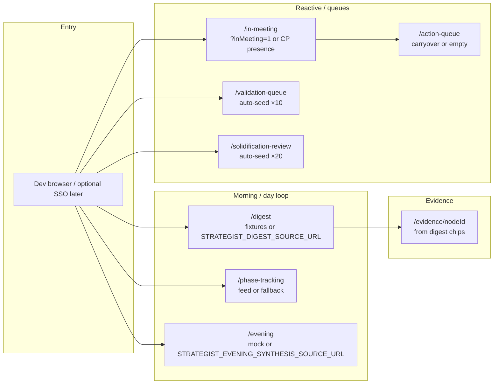
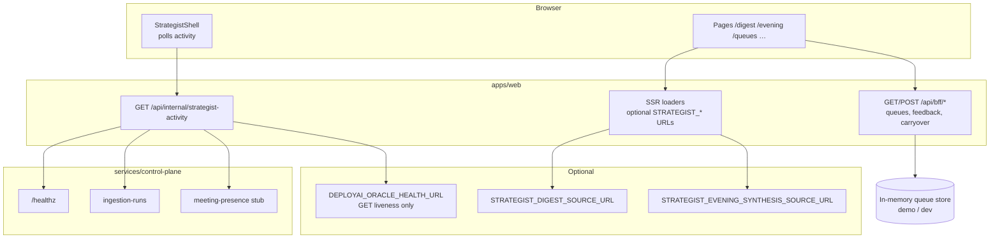
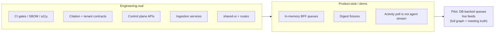

# What’s actually here

**Living document.** Update this file when epics ship, env contracts change, or a surface moves from mock → live. Goal: one honest place to **catalog reality**, **demo the product**, and **talk to stakeholders** without conflating “CI green” with “operator’s daily driver.”

## 0. How to keep this document honest

1. **A PR changes strategist data** (loaders, `apps/web/src/app/api/bff/*`, CP routes feeding activity or digest): edit the **§2 table** and add a **§11 changelog** row (date + one line).
2. **A PR changes “how demo-able we are”** (new env var, new fallback): update **§7** and/or **[.env.example](./.env.example)**; mention the var here if strategists need it for demos.
3. **An epic’s *truth* changes** (e.g. queues move off in-memory store): refresh **§3**, **§6**, or **§8** so “pilot” language stays accurate.

| Quick rule | If it affects what appears on `/digest`, `/evening`, `/in-meeting`, or `/api/internal/strategist-activity`, touch **§2** + **§11**. |
|------------|-------------------------------------------------------------------------------------------------------------------------------------|

**Env template:** strategist-facing variables are commented in [.env.example](./.env.example) under **apps/web — strategist surfaces**.

---

## 1. TL;DR

- **A lot of “hard work” is real:** monorepo gates, schemas, tenant-isolation tests, ingestion/control-plane direction, agent/eval **contracts and harnesses**, design system, strategist **screens and flows**.
- **The strategist browser experience is often demo-shaped:** digest/evening/phase can use **fixtures or optional HTTP URLs**; queues use an **in-memory BFF store**; meeting presence uses **CP stub + URL flags**; **no live agent streaming** into the UI today.
- **“Demo usable”** = walk the workflow with fixtures + dev role headers + optional env URLs + CP where configured. **“Pilot usable”** = same surfaces backed by **durable APIs + tenant truth**. See **§7** (checklist) and **§8** (stages).

---

## 2. Strategist surfaces: what drives them

| Surface | Default data | “More real” lever |
|---------|----------------|-------------------|
| `/digest` | `MORNING_DIGEST_TOP` in code | `STRATEGIST_DIGEST_SOURCE_URL` → validated JSON array |
| `/phase-tracking` | Optional remote feed; else seeded fallback + banner | Wire feed; fix payload to schema |
| `/evening` | Mock slice + patterns; solidification **nudge count** from in-memory store | `STRATEGIST_EVENING_SYNTHESIS_SOURCE_URL` |
| `/in-meeting` | Meeting signal from activity poll + digest-aligned fixtures | CP `meeting-presence` + stub tenant env; or `?inMeeting=1` |
| `/action-queue` | Empty until carryover or tests | In-meeting end → carryover POST; later CP rows |
| `/validation-queue` | **Auto-seeded** 10 rows on first tenant touch (BFF) | Replace with CP-backed queue |
| `/solidification-review` | **Auto-seeded** 20 rows on first tenant touch | Replace with CP-backed queue |
| `/evidence/[nodeId]` | Works for fixture IDs linked from digest | Needs canonical graph backing same IDs |
| `/overrides` | Override history + composer; BFF → CP **durable** overrides API | CP migrated + tenant-scoped actor; evidence search for composer |
| `/audit/personal` | Personal activity rows; BFF → CP strategist activity | Same CP coupling as other strategist routes |
| Activity / degrade banners | `GET /api/internal/strategist-activity` → CP + ingest + optional Oracle **health** URL | `DEPLOYAI_ORACLE_HEALTH_URL` (liveness, not inference) |

All `STRATEGIST_*`, `DEPLOYAI_ORACLE_HEALTH_URL`, `NEXT_PUBLIC_DEPLOYAI_STRATEGIST_ACTIVITY_POLL_MS`, and CP URL/key pairs for web are **documented as comments** in [.env.example](./.env.example).

---

## 3. What shipped across core epics (framing)

Rough mapping (see [_bmad-output/implementation-artifacts/sprint-status.yaml](./_bmad-output/implementation-artifacts/sprint-status.yaml) for story-level truth). **Epic 7**, **Epic 9**, and **Epic 10** are story-complete on `main` for their scoped stories; **CP-backed queues** (action / validation / solidification) remain future work—the BFF **in-memory** store still applies there. **Epic 11** (macOS edge capture agent) is story-complete for scoped **Tauri** work — transcripts, FOIA verifier alignment, Sparkle verify path, CP kill-switch — not full continuous CoreAudio production capture until follow-up.

| Area | What you got |
|------|----------------|
| **Epic 1** | Scaffold, CI/SBOM/CVE posture, a11y gates, tokens, **citation envelope + isolation + continuity** tests — *rules of the road* |
| **Epics 2–3** | Identity/tenancy and ingestion **plumbing** (services, CP direction) |
| **Epics 4–6** | Agent runtime **contracts**, eval harness, providers, cartographer/oracle **design** — *lab + spec*, not full browser loop |
| **Epic 7** | **shared-ui** primitives (citation, evidence, alert, validation card, …) — reusable, tested components |
| **Epic 8** | Strategist **shell**: digest, phase, evening, Cmd+K, evidence deep links, degraded states |
| **Epic 9** | In-meeting **UX**, carryover, action-queue **lifecycle APIs**, validation/solidification **surfaces** (BFF mock store) |
| **Epic 10** | **Durable** learning overrides, private annotation crypto, citation supersession plumbing, **`/overrides`** + **`/audit/personal`** via BFF → CP |
| **Epic 11** | **Edge agent** (`apps/edge-agent`): capability model, Ed25519 identity, **v1/v2** transcript bundles, **`foia verify`** compatibility + revocation sidecar, Sparkle **fetch/verify** tooling, CP **kill-switch** poll — **parallel** to Epic **12** (FOIA/export) and Epic **14** (post-V1 platform); see [`docs/edge-agent/capabilities.md`](./docs/edge-agent/capabilities.md) |

**Not the same as:** “Strategist opens app → live model continuously updates every surface with production data.” That’s **deeper integration** (queues, live feeds, agent-driven updates) beyond what shipped in Epics 7–10.

---

## 4. Mermaid — demo user journey (fixture-heavy)

---

## 5. Mermaid — data & control flow (web ↔ CP ↔ BFF)

---

## 6. Mermaid — “real” vs “stub” lens

---

## 7. Demo-usable checklist (for you + guests)

Use this to run a **credible demo** without claiming full production.

- [ ] **Build:** `pnpm install --frozen-lockfile` && `pnpm turbo run lint typecheck test build` (or CI green on branch).
- [ ] **Web:** `apps/web` — `pnpm dev` or `pnpm start` after `pnpm build`; strategist routes require role (dev middleware injects strategist — see [docs/dev-environment.md](./docs/dev-environment.md)).
- [ ] **Digest path:** Open `/digest` → expand citation → `/evidence/...` works for fixture-linked IDs.
- [ ] **Degraded story (optional):** `?agentError=1` / `?ingest=1` on surfaces to show banners (Epic 8.7).
- [ ] **In-meeting:** `?inMeeting=1` **or** CP stub tenant for meeting-presence; end meeting → carryover toast → `/action-queue` shows rows.
- [ ] **In-meeting alert position (Story 9.8):** Drag position + reset are **`localStorage` only** (per browser / profile). **No server or cross-device** layout sync yet—say that plainly in demos; a follow-up would persist coordinates (or a named preset) via CP or user preferences.
- [ ] **Queues:** `/validation-queue` and `/solidification-review` show cards immediately (auto-seed).
- [ ] **Optional realism:** Set `STRATEGIST_DIGEST_SOURCE_URL` / evening URL / `DEPLOYAI_CONTROL_PLANE_URL` + internal key per dev docs and [.env.example](./.env.example).
- [ ] **Say honestly:** “Surfaces are production-shaped; much data is fixture or BFF mock until CP tables back these queues.”

---

## 8. How far to “actually usable” for operators

| Stage | Meaning |
|-------|---------|
| **Demo** | Above checklist; stakeholders see **intent and UX**. |
| **Pilot** | Queues + audits + digest/synthesis **durable per tenant**; meeting from **real calendar**; ingestion **feeds** evidence graph. **`/overrides`** + **`/audit/personal`** (Epic 10) are only as credible as **tenant/session boundaries** — align with real SSO (Epic 2 path), not dev-only headers alone (Epic 10 retrospective). |
| **Production** | SSO/session as deployed; **agent events** or batch jobs **drive** updates; **Epic 10** trust/override **durable**; no dev-only role injection. |

---

## 9. Related docs

- [docs/dev-environment.md](./docs/dev-environment.md) — local run, headers, poll interval, CP vars.
- [.env.example](./.env.example) — CP, OIDC, ingestion placeholders.
- [_bmad-output/implementation-artifacts/sprint-status.yaml](./_bmad-output/implementation-artifacts/sprint-status.yaml) — story-level done/in-progress.
- [docs/diagrams/deployai-bmad-and-runtime-flow.mjs](./docs/diagrams/deployai-bmad-and-runtime-flow.mjs) — BMAD + runtime export (Mermaid JS).
- **Epic retros:** [Epic 1](./_bmad-output/implementation-artifacts/epic-1-retrospective-2026-04-26.md), [Epic 6](./_bmad-output/implementation-artifacts/epic-6-retrospective-2026-04-26.md), [Epic 7](./_bmad-output/implementation-artifacts/epic-7-retrospective-2026-04-26.md), [Epic 8](./_bmad-output/implementation-artifacts/epic-8-retrospective-2026-04-26.md), [Epic 9](./_bmad-output/implementation-artifacts/epic-9-retrospective-2026-04-28.md), [Epic 10](./_bmad-output/implementation-artifacts/epic-10-retrospective-2026-04-26.md), [Epic 11](./_bmad-output/implementation-artifacts/epic-11-retrospective-2026-04-26.md), [Epic 15](./_bmad-output/implementation-artifacts/epic-15-retrospective-2026-04-26.md), [Epic 16](./_bmad-output/implementation-artifacts/epic-16-retrospective-2026-04-26.md).
- **Customer pilot (BMAD):** [_bmad-output/planning-artifacts/epics.md](./_bmad-output/planning-artifacts/epics.md) — **Epic 15** (prerequisites) → **Epic 16** (onboarding + integrations + CP loaders); **operator docs:** [docs/pilot/README.md](./docs/pilot/README.md) and [docs/pilot/hosted-environment.md](./docs/pilot/hosted-environment.md); see §10 below.

---

## 10. FDE field evaluation pilot

Use this when a **real Forward Deployed Engineer** (or customer strategist) should **try the product** on a shared URL—not just a developer laptop.

**Minimum credible build** (UX walkthrough, single region, honest limits):

1. **Hosted `apps/web`** — production `next build` + `next start` (or platform equivalent); HTTPS; secrets from a vault—not committed `.env`.
2. **Strategist auth** — replace **dev-only role injection** with real **tenant SSO / session** (see Epic 2: Entra OIDC/SAML path) and a role equivalent to **deployment strategist** so `/digest`, `/in-meeting`, queues are allowed.
3. **Control plane** — deployed `services/control-plane` (or your chosen host), reachable URL; **`DEPLOYAI_CONTROL_PLANE_URL`** + **`DEPLOYAI_INTERNAL_API_KEY`** (and browser **`NEXT_PUBLIC_CONTROL_PLANE_URL`** if used) set consistently; DB migrated.
4. **Strategist activity truth** — CP endpoints behind `loadStrategistActivityForActor` return coherent **meeting-presence**, **ingestion**, and optional **Oracle health** for that tenant—so banners and `/in-meeting` are not fiction.
5. **Digest / evening (pick one)** — either **`STRATEGIST_DIGEST_SOURCE_URL` / `STRATEGIST_EVENING_SYNTHESIS_SOURCE_URL`** pointing at **your** JSON feeds, or a short-term **seed job** that writes fixture-shaped data—operators must know which.
6. **Evidence IDs** — citations deep-linking to **`/evidence/:nodeId`** need **IDs that exist** in your canonical graph (or scoped demo dataset).
7. **Queues / BFF (critical)** — today’s **`strategist-queues-store` is in-process**. For FDE testing with **more than one web replica** or **restart-heavy** deploys, either run **a single replica** and accept data loss on deploy, or **build CP/DB-backed queue APIs** first—otherwise action/validation/solidification state will **surprise** testers.

**Stronger pilot** (closer to §8 “Pilot” stage): durable queues + audits, real calendar-driven meeting signal, ingestion feeding the evidence graph, no reliance on query-string demo flags.

**Support:** error logs, [docs/pilot/support-runbook.md](./docs/pilot/support-runbook.md), known limitations (this file + retros), and a named internal contact for “is this a bug or expected mock?”

---

## 11. Changelog (high signal)

| Date | Change |
|------|--------|
| 2026-04-26 | Initial catalog: surfaces table, epic framing, mermaid flows, demo checklist, distance-to-pilot. |
| 2026-04-26 | §0 maintenance workflow; §2 pointer to `.env.example` strategist vars; Epic 7/9 story-complete note. Story **9.8**: header **context menu** “Reset position to default” (`InMeetingAlertCard`). Story **7.15**: VPAT aggregator + `vpat-evidence.yml` tracked as done in sprint-status. |
| 2026-04-27 | §7: explicit **9.8** caveat—in-meeting alert **position is `localStorage` only** (not cross-device / server-backed). |
| 2026-04-28 | §10 **FDE pilot** checklist; Epics **7–9** retrospectives closed in sprint-status; `strategist-queues-store` deploy note (multi-instance). |
| 2026-04-28 | **Epics 15–16** in `epics.md` + sprint grid; **docs/pilot/** operator pack; **`DEPLOYAI_STRATEGIST_REQUIRE_TENANT`** middleware; Epic **15** stories closed for pilot prerequisites. |
| 2026-04-28 | **Epic 10** on `main` (PR #58): CP-backed overrides + personal audit surfaces (`/overrides`, `/audit/personal`), citation envelope / oracle supersession alignment, private-scope annotations. **Epic 11.1** (PR #59): edge-agent Tauri **capability scaffold** + CI capability audit + `docs/edge-agent/capabilities.md` — not production capture yet. **§2** / **§3** updated for pilot catalog accuracy. |
| 2026-04-26 | **Epic 11** marked done in sprint-status (edge capture agent V1 scope); retros recorded for **Epics 1, 6, 10, 11, 15, 16**; §3 adds Epic **11** row + parallel Epic **12**/**14** note; §9 links expanded. |

---
